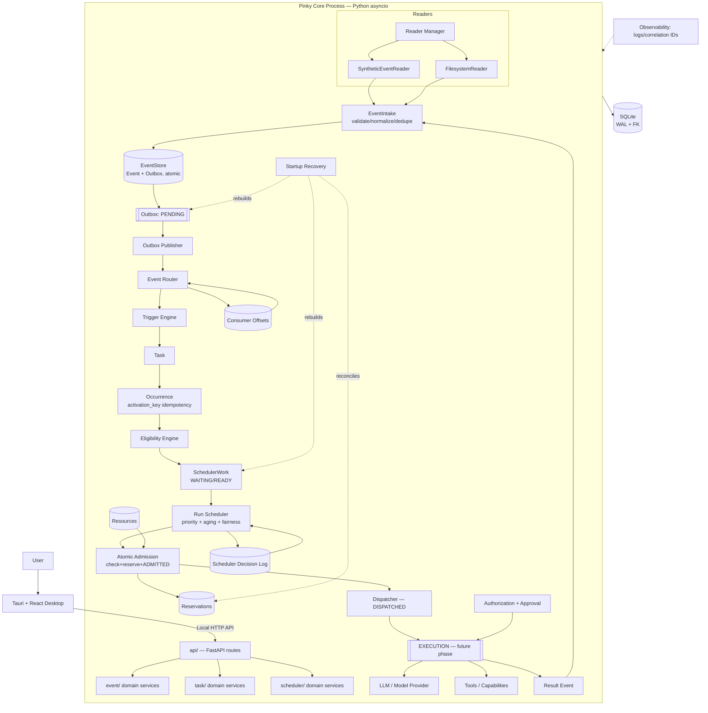

# Pinky — Architecture Blueprint

**Status:** Consolidated engineering reference
**Basis:** Full read of `planning/`, inspection of `apps/core` implementation, `migrations/`, tests
**Purpose:** Long-term reference for implementing Pinky phase-by-phase without re-deriving architecture decisions each time

---

## 1. Executive Summary

Pinky is currently in **early Phase 1**: the repository has a working, tested, but incomplete Event subsystem (domain model, persistence, outbox), no Task/Trigger/Occurrence subsystem, no Scheduler, no Readers, no API, and none of the `common/`, `config/`, or `runtime/` packages described in the package architecture.

The planning corpus (`planning/*.md`) is internally coherent on the big architectural bets — Event ≠ Task ≠ Occurrence ≠ SchedulerWork ≠ Execution, SQLite as durable truth, persist-before-publish, atomic admission, non-preemptive scheduling — and these should **not** be revisited. What needs attention is narrower and more concrete:

1. Two competing "event store" implementations exist in the codebase with different guarantees, and nothing declares which is canonical.
2. The Event Intake pipeline described in the planning docs (validate → normalize → dedupe-check → persist → ACCEPTED/DUPLICATE/REJECTED) is not actually assembled anywhere as one component; it's currently reconstructed by hand inside test code.
3. A package `__init__.py` file contains test code, which is a correctness defect, not a style issue.
4. Everything past the Event subsystem (Outbox publisher, consumer offsets, router, readers, Task, Scheduler, API, `common/`, `runtime/`, `config/`) is unbuilt, which is expected at this stage but means the phase plan below picks up close to where `plan.md` already describes it.

Nothing here requires re-architecting Pinky. The recommended path is: fix the two concrete defects, finish the Event subsystem exactly as specified, then proceed down the existing phase order in `plan.md`, which is sound.

---

## 2. What Pinky Is

Pinky is a **local-first, single-user, single Core runtime process, event-driven runtime** whose job is to turn heterogeneous inputs (filesystem, timers, user messages, application signals) into durable historical facts (Events), decide which persistent responsibilities (Tasks) those facts activate, represent each activation as an Occurrence, decide when an Occurrence is allowed to run (Eligibility), and decide when it actually gets to run given finite capacity (Scheduler/Admission). Execution — actually doing the work, possibly using an LLM — is explicitly out of scope for the current implementation boundary; the system stops at "dispatch intent."

**Pinky is not:**
- An LLM agent framework where the model drives control flow. The LLM is a replaceable capability invoked *by* the runtime under authorization, never the source of scheduling or safety decisions.
- A distributed system. Phase 1 is one machine, one user, one Core process, SQLite.
- A generic workflow engine or job queue. It has an opinionated, closed set of five entities (Event, Task, Occurrence, SchedulerWork, Reservation) and deliberately resists generalizing beyond them.

**The Core owns**: Event, Task, Occurrence, Scheduler, Admission, and persistence. **The desktop shell (Tauri + React) owns**: UI rendering and user interaction, and talks to Core only through the local API — never SQLite directly.

**What must survive a crash**: all Event history, Outbox state, consumer offsets, Task/Occurrence/SchedulerWork state, resource reservations, and scheduler decision records. **What must never be authoritative**: in-memory queues, in-memory timers, APScheduler's own state (if used).

**Trust boundary**: untrusted external content (file contents, emails, web pages) can enter an Event payload and even be read by an LLM, but it can never grant itself a capability, an approval, or authorization — those are separate, explicit gates that sit between "the LLM proposed something" and "the system did something."

---

## 3. Project Goals (as stated across planning docs)

- Durable, replayable, deduplicated event ingestion from heterogeneous sources (FR-01–FR-05).
- Persistent Task responsibility model with pluggable triggers (SCHEDULE/EVENT/CONDITION/MANUAL) and idempotent activation into Occurrences (FR-06–FR-09).
- Eligibility strictly separated from resource/concurrency admission (FR-10).
- A scheduler with derived (not persisted) effective priority, bounded aging, atomic resource admission, non-preemptive execution, simple backfill, and full crash recovery (FR-11–FR-24).
- A hard separation of authorization / approval / execution, with capabilities as the only path to an external side effect (FR-25, safety invariants).
- Stop at "dispatch intent" — no real Execution engine yet.

These goals are stable across `Pinky_Architecture_v1.md`, `Pinky_Domain_Model_and_State_Machines_v1.md`, `Pinky_System_Design_Specification_v1.md`, and `Pinky_Database_Schema_v2.md`. I did not find a place where they contradict each other on the *goals*; the inconsistencies I found (Section 5) are in *document mechanics and implementation follow-through*, not in intent.

---

## 4. Current Repository Analysis

### 4.1 What exists, by package

| Path | Exists? | Notes |
|---|---|---|
| `apps/core/src/pinky_core/event/models.py` | ✅ | `IncomingEvent` + `Event`, frozen pydantic models, UTC-normalizing validators. Matches DB schema v2 field list (`event_id, event_type, source, occurred_at, received_at, payload, event_metadata, causation_id, correlation_id, source_event_id, dedupe_key, schema_version`). |
| `event/intake.py` | ✅ (partial) | `EventIntake.accept()` only stamps `received_at` and builds an `Event`. No validation, no dedupe check, no persistence, no result type (`ACCEPTED/DUPLICATE/REJECTED`). |
| `event/validation.py` | ✅ (disconnected) | `EventValidation.validate()` checks non-empty type/source, timestamp ordering, schema_version ≥ 1. **Not called by Intake** — only invoked manually in tests. |
| `event/repository.py` | ✅ | Abstract `EventRepository` (append/get/find_by_source_event/find_by_dedupe_key/read_after). |
| `event/router.py` | ❌ | Does not exist. Router/Trigger Engine dispatch is entirely unbuilt. |
| `event/readers/` | ❌ | Does not exist. No `SyntheticEventReader`, no Reader Manager. |
| `persistence/database.py` | ✅ | `create_engine`, `create_session_factory`, WAL + `PRAGMA foreign_keys=ON` set on connect. Matches spec §12.2/§29. |
| `persistence/event_mapper.py` | ✅ | `event_to_orm` / `orm_to_event`, JSON-serializes payload/metadata with compact separators. Correct round-trip, covered by tests. |
| `persistence/event_store.py` (`EventStore`) | ✅ | `append()` inserts `EventORM` + `OutboxORM` in **one transaction** — this is the component that actually satisfies persist-before-publish. |
| `persistence/event_repository.py` (`SQLiteEventRepository`) | ✅ | Implements the `EventRepository` ABC: `append/get/find_by_source_event/find_by_dedupe_key/read_after`. **`append()` inserts only `EventORM` — no outbox row.** |
| `persistence/outbox_repository.py` | ✅ | `create_for_event(session, event_id, created_at)` (used inside someone else's transaction) and `get_pending(limit)`. |
| `persistence/models/event.py`, `outbox.py` | ✅ | Match DB Schema v2 columns, checks, and index names, verified in `test_schema_constraints.py` / `test_sqlite_schema.py`. |
| `persistence/event_record.py` (`StoredEvent`) | ✅ | Frozen dataclass pairing `event_seq` with `Event`, used by `read_after`. |
| `migrations/` (Alembic) | ✅ (minimal) | One revision (`76d283d4db3d`) creates `events` + `outbox` only. `env.py` reads `PINKY_DATABASE_URL` with fallback to `alembic.ini`. Correct async engine wiring. |
| `common/` (`ids.py`, `errors.py`, `time.py`, `types.py`) | ❌ | Does not exist. `EventIntake` takes a raw `clock: Callable` instead of the planned `Clock` Protocol. |
| `config/`, `runtime/`, `api/` | ❌ | Do not exist. `fastapi`/`uvicorn` are declared dependencies but unused in source. |
| `task/`, `scheduler/` | ❌ | Do not exist at all — as expected at this stage, since `plan.md`'s own ordering puts these after Event subsystem completion. |
| `apps/core/src/pinky_core/__init__.py` | ⚠️ **Defect** | Contains `import pytest` and four `test_*` functions duplicating `tests/event/test_models.py`, sitting inside the package's own `__init__.py`. See §9.1. |
| `apps/core/tests/database/inspect_db.py` | ⚠️ | A manual `sqlite3` inspection script (not `test_`-prefixed asserts, uses `print`) committed under `tests/`. Connects to a relative `pinky.db` that likely doesn't exist in CI. Harmless if pytest doesn't collect it as a test, but it's inspection tooling, not a test — wrong location. |
| `apps/core/tests/integration/test_event_persistence.py` **and** `test_event_persistence_1.py` | ⚠️ | Near-duplicate integration tests exercising the same Intake→Validate→Store→Repository→Outbox path. Redundant, not wrong. |

### 4.2 Test coverage as it stands

Unit tests exist for: `Event` model invariants (immutability, UUID generation, UTC normalization, schema_version default), the mapper round-trip, `SQLiteEventRepository` CRUD/read_after, `EventStore` append/outbox atomicity (including a genuine atomicity test that forces an outbox insert failure and asserts nothing was persisted — this is a good test), the outbox repository, and schema/index shape. This is solid coverage **for the pieces that exist**, but there is no test of `EventIntake` performing validation or deduplication, because it doesn't do either yet, and no test of the two append paths being reconciled — because they aren't.

### 4.3 Repository-vs-plan verdict

Nothing in the repository claims to implement Task, Trigger, Occurrence, Scheduler, Reader, Router, or API — and indeed none of it exists. The repository is honestly at "Phase 4–6" of `plan.md`'s own ordering (Event domain model, Event Store, partial Event Intake, partial Outbox), roughly 2 phases behind where the *domain model* is complete relative to spec (validation isn't wired in, dedup isn't handled at the Intake layer, and there's no single canonical append path).

---

## 5. Planning Document Analysis

### 5.1 Documents read

`Pinky_Architecture_v1.md`, `Pinky_Core_Architecture.md`, `Pinky_Domain_Model_and_State_Machines_v1.md`, `Pinky_Database_Schema_v2.md`, `Pinky_System_Design_Specification_v1.md`, `Pinky_Tech_Stack_v1.md`, `Pinky_event_subsystem.md`, `plan.md`.

### 5.2 Cross-document consistency — the big decisions agree

Across all seven documents, the following are stated identically and never contradicted:
- Event/Task/Occurrence/SchedulerWork/Execution are five distinct entities with five distinct owners.
- `QUEUED` is explicitly *not* a durable SchedulerWork state (in-memory only); durable states are `WAITING → READY → ADMITTED → DISPATCHED`, with `CANCELLED`/`EXPIRED` as exceptional exits.
- Effective priority is derived at scheduling time, never persisted as authoritative.
- Resource check + reservation + admission-transition must be one atomic transaction, and that transaction must never span external execution.
- SQLite + SQLAlchemy 2 + Alembic + `uv` + Ruff + pytest + asyncio, no external broker, no Redis/Kafka/Temporal in Phase 1.
- Scheduling ≠ authorization ≠ approval ≠ execution; untrusted content cannot grant authority; LLM output is a proposal, never authority.

I found no place where these are disputed. They should be treated as settled.

### 5.3 Document-level defects found

1. **`Pinky_Domain_Model_and_State_Machines_v1.md`, §7.3–7.4**: the SchedulerWork state list renders as `WAITING / READY / <blank> / ADMITTED / DISPATCHED`, and a subsection header that should describe the in-memory "queued" concept is empty (`### ` with no title), while its body text ("The Scheduler has accepted the work into its active scheduling set") clearly describes what every other document calls the *non-durable, in-memory* queue-membership state. This is a content-loss artifact from editing, not a new architectural decision — it should **not** be read as introducing a fifth durable state. Recommend patching the heading back to something like "In-memory queue membership (non-durable)" to avoid a future reader concluding a state was silently added.
2. **`Pinky_System_Design_Specification_v1.md`**: section numbering collides — `## 17. Safety Architecture` appears immediately after `# 15. Legal...`-adjacent content with `16.1–16.10` subsections nested under it, and then a second, unrelated `# 17. API Architecture` follows with its own `16.1 Boundary` subsections. Section "16" as a top-level heading is missing/renamed. This is purely a document-numbering defect; the *content* of both Safety Architecture and API Architecture is unambiguous and non-contradictory, but the numbering should be repaired so future cross-references ("see §16.3") resolve to the right section.
3. **`Pinky_Architecture_v1.md` §6** ("Canonical Event", minimum field list) omits `source_event_id`/`dedupe_key` from its "at minimum" list, while `Pinky_Database_Schema_v2.md` and `Pinky_Domain_Model_and_State_Machines_v1.md` both treat them as canonical (optional-but-present) fields. Not a contradiction — just an incomplete enumeration in the older document. The current `Event` pydantic model already includes both fields, so implementation has correctly followed the more complete spec.

### 5.4 Source-of-truth hierarchy

Because documents occasionally state the same concept at different levels of detail, use this precedence when they appear to differ (they rarely substantively do):

1. **`Pinky_Database_Schema_v2.md`** — authoritative for exact column names, types, constraints, indexes. Supersedes `_v1` explicitly and supersedes anything implied by the domain-model doc's "conceptual fields" lists.
2. **`Pinky_System_Design_Specification_v1.md`** — authoritative for numbered functional/non-functional requirements (FR-xx/NFR-xx) and for cross-subsystem invariants (§26).
3. **`Pinky_Domain_Model_and_State_Machines_v1.md`** — authoritative for entity meaning, lifecycle graphs, and ownership.
4. **`Pinky_Architecture_v1.md`** — authoritative for the high-level subsystem responsibilities and the canonical event/scheduler flow diagrams.
5. **`Pinky_Core_Architecture.md`** — authoritative for package/folder layout and dependency-direction rules.
6. **`Pinky_event_subsystem.md`** — authoritative for Event Intake pipeline behavior specifically (validation, normalization, dedup semantics, reader contract).
7. **`Pinky_Tech_Stack_v1.md`** — authoritative for technology choices only; does not redefine domain behavior (states this explicitly in its own §14).
8. **`plan.md`** — authoritative for *implementation ordering*, not for architecture; treat it as a sequencing guide whose granularity this blueprint refines (§27 below), not as a source of new requirements.

---

## 6. Current vs. Intended Architecture (Summary Table)

| Area | Current repository | Intended architecture | Gap |
|---|---|---|---|
| Event domain model | Complete, tested | Complete | None |
| Event validation | Exists, standalone | Must run inside Intake before persistence | Not wired in |
| Event deduplication | DB constraint only | App-level preliminary check + DB constraint as final authority + `ACCEPTED/DUPLICATE/REJECTED` result | Missing app-level check and result type |
| Event persistence | Two divergent implementations | One canonical append path with atomic event+outbox | Needs reconciliation |
| Outbox | Table + repository exist | Table + repository + **publisher** | Publisher missing |
| Consumer offsets | Not implemented | `consumer_offsets` table + processing rule | Missing entirely |
| Event router | Not implemented | Routes persisted events to consumers, in-process | Missing entirely |
| Readers / Reader Manager | Not implemented | `SyntheticEventReader` first, then filesystem reader, isolated failure/restart | Missing entirely |
| Task / Trigger / Occurrence | Not implemented | Full domain + lifecycle + activation idempotency | Missing entirely (expected at this stage) |
| Eligibility | Not implemented | Separate from resource admission | Missing entirely |
| SchedulerWork / Scheduler | Not implemented | Full priority/aging/admission/recovery | Missing entirely |
| Resources / Reservations | Not implemented | Atomic admission transaction | Missing entirely |
| Dispatcher | Not implemented | Stub/interface only for Phase 1 | Missing entirely |
| API (`api/`) | Not implemented, deps declared | FastAPI exposing domain operations, not CRUD | Missing entirely |
| `common/` (ids, clock, errors) | Not implemented | Shared primitives used everywhere | Missing; `Clock` currently informal callable |
| `config/`, `runtime/` | Not implemented | Bootstrap/lifecycle, layered config | Missing entirely |
| Observability | Not implemented | Structured logs + correlation IDs + OTel later | Missing entirely |
| Package hygiene | `__init__.py` contains test code; duplicate/near-duplicate test files; unused imports | Clean package boundaries, lint enforced | Needs cleanup |

---

## 7. Architectural Assessment

### 7.1 Architecture (separation of concerns, dependency direction)

The intended dependency direction (`domain → repository interface → persistence impl → SQLAlchemy`) is **honored** in the code that exists: `event/repository.py` defines the abstract contract, and `persistence/event_repository.py` implements it — the `event/` package itself never imports SQLAlchemy. This is a real strength; keep it.

The one violation is structural rather than a dependency-direction problem: `EventStore` (in `persistence/`) does the job that, architecturally, should be a single implementation of *the same contract* `EventRepository` describes, or `EventRepository` should be the thing that owns outbox insertion. Right now there are two objects with overlapping but different responsibilities, and neither is clearly "the" Event Store the rest of the system is supposed to call. This needs a decision (see §16, Decision Register, and §10 Phase 2).

### 7.2 Persistence

Transaction boundaries are short and correctly scoped in every persistence method inspected (`async with session.begin(): ...`), consistent with NFR-04 (atomicity) and the rule against holding transactions over external work. The atomicity test in `test_event_store.py` (forcing an outbox insert failure and confirming neither row survives) is exactly the kind of test the spec calls for and should be the template for equivalent tests once Task/Occurrence/SchedulerWork tables exist.

Migrations are handled correctly for what exists (`render_as_batch=True` for SQLite ALTER TABLE limitations, offline/online mode support), but there is only one revision — no evidence yet of the discipline plan.md calls for ("never change schema without a recorded migration") being tested under a *second* migration. Recommend the next schema change (Task tables) deliberately exercise `alembic revision --autogenerate` end-to-end early, rather than assuming it will work.

### 7.3 Event subsystem

Strengths: immutability is enforced (`ConfigDict(frozen=True)`), UTC normalization is enforced via validators on both `IncomingEvent` and `Event`, `event_seq` vs `event_id` are correctly kept as separate concepts (autoincrement PK vs UUID identity), and partial unique indexes correctly scope dedup/source-identity uniqueness to `source` and only apply `WHERE ... IS NOT NULL` (matches spec exactly).

Weaknesses: no orchestrating "Intake service" that actually performs the full pipeline (validate → normalize → dedupe-check → persist → result). Today, `EventIntake.accept()` is nearly a no-op wrapper around `Event.from_incoming` — it does not call `EventValidation`, does not check for existing dedupe/source keys, does not persist, and does not return a tri-state result. The integration tests currently stitch these steps together by hand, which means the *pipeline* has no owner and no single point where "what happens on a duplicate" is decided. Per `Pinky_event_subsystem.md` §10, this tri-state (`ACCEPTED/DUPLICATE/REJECTED`) is supposed to be a first-class part of the Intake API, not an artifact of test code.

### 7.4 Task, Scheduler, Execution, AI/LLM, Safety

None of these exist yet, so there is nothing to assess for correctness. The planning documents' treatment of each is internally sound (Eligibility vs. Admission separation, non-preemptive scheduling, capability-mediated execution, LLM-as-proposal-not-authority) and requires no revision before implementation begins. The main risk is *sequencing* discipline — see §9.3 (Risk: premature LLM/Task work).

### 7.5 Operations

No logging, metrics, tracing, or configuration layer exists yet. This is appropriate for the current phase (`common/`, `config/`, `runtime/` are explicitly the next things `plan.md` calls for) but should not be deferred past the Reader phase, because Reader failure isolation (a Phase-1 requirement, NFR-07) is hard to verify without at least basic structured logging.

---

## 8. Identified Risks and Gaps

| # | Severity | Risk | Where | Why it matters | Mitigation |
|---|---|---|---|---|---|
| R1 | **Critical** | `pinky_core/__init__.py` contains pytest-dependent test functions | `apps/core/src/pinky_core/__init__.py` | Any import of the `pinky_core` package pulls in `pytest` (a dev dependency) at module load, defines duplicate/shadow tests inside the production namespace, and risks pytest silently double-collecting these tests from two locations. Violates the domain/test boundary explicitly. | Delete the test code from `__init__.py`; leave it empty (or with legitimate package-level exports only). The equivalent, correct tests already exist in `tests/event/test_models.py`. |
| R2 | **High** | Two non-interoperable event-append paths (`SQLiteEventRepository.append` vs `EventStore.append`) | `persistence/event_repository.py`, `persistence/event_store.py` | If `SQLiteEventRepository.append()` is ever used as the actual ingestion entry point (its interface signature — `EventRepository.append` — looks like the "correct" one to call), events are persisted **without** an outbox row, silently breaking the persist-before-publish guarantee and permanently losing delivery for that event. | Decide canonical ownership now (see Decision Register, D-1). Recommended: `EventStore` becomes the sole write-path (event+outbox atomic); `SQLiteEventRepository` becomes read-only (`get/find_by_.../read_after`) or is merged into `EventStore`. |
| R3 | **High** | Event Intake performs no validation, no dedup check, no persistence, no result type | `event/intake.py` | Deviates from FR-04 and `Pinky_event_subsystem.md` §6–11. Currently any caller can persist an unvalidated `Event`, and a duplicate submission surfaces as a raw `IntegrityError` rather than a domain-level `Duplicate` result, which every future consumer of Intake (Readers, API) will need to handle correctly and consistently. | Build the actual Intake orchestrator in Phase 2 below before any Reader is implemented — Readers should never need to know about validation/dedup mechanics themselves. |
| R4 | **Medium** | Duplicate test function name silently shadows a test | `tests/persistence/test_event_repository.py` | `test_read_after_returns_events_in_sequence_order` is defined twice; pytest only runs the second, so part of the intended coverage (verifying `event_seq` via `hasattr` fallback logic) never executes. Masks a real coverage gap. | Rename one of the two tests; audit the file for what each was actually meant to prove. |
| R5 | **Medium** | Lint not currently enforced | Repository-wide | `ruff` selects `F` (unused imports etc.), yet an unused `EventORM` import survives in `tests/persistence/test_event_repository.py`. Suggests `uv run ruff check .` is not a CI gate yet, despite `plan.md` §0.2 calling for it before proceeding. | Add `ruff check` / `ruff format --check` to CI now, before more files accumulate lint debt. |
| R6 | **Medium** | `fastapi`/`uvicorn` declared but unused | `pyproject.toml` | Not harmful, but signals a dependency was added ahead of the code that needs it — worth tracking so it doesn't mask a "the API almost exists" false impression. | No action required; just don't assume `api/` exists because the dependency does. |
| R7 | **Low** | Manual DB-inspection script lives under `tests/` | `tests/database/inspect_db.py` | Not a pytest test (no assertions, uses `print`), connects to a relative hardcoded `pinky.db`. Confuses "tests" with "developer tooling." | Move to a `scripts/` or `tools/` directory outside `tests/`. |
| R8 | **Low** | Near-duplicate integration test files | `tests/integration/test_event_persistence.py`, `test_event_persistence_1.py` | Redundant maintenance surface; if they drift, one becomes stale without anyone noticing. | Merge into one file, keep the more complete assertions. |
| R9 | **Informational** | `Clock` is an ad hoc callable, not the planned `Protocol` | `event/intake.py`, `event/store.py` | Works fine today; will need to be formalized once Scheduler/Wake-Scheduler code needs deterministic fake clocks shared across subsystems (`plan.md` Phase 1, "Core runtime foundation"). | Introduce `common/time.py` with a `Clock` Protocol + fake clock before Scheduler work begins; retrofit `EventIntake`/`EventStore` to accept it, this is a compatible, non-breaking change since both already accept an injectable callable. |
| R10 | **Informational** | Two planning-document defects (blank SchedulerWork state heading, duplicated §17 numbering) | `Pinky_Domain_Model_and_State_Machines_v1.md`, `Pinky_System_Design_Specification_v1.md` | Doesn't affect implementation correctness but could mislead a future reader into thinking a new durable state or section was intentionally introduced. | Patch headings; no design change needed. |

None of these risks require a *design* change — they are implementation-discipline and reconciliation issues, all addressable within the current architecture.

---

## 9. Final Recommended Architecture

The architecture in `planning/` is adopted as-is with two clarifications, both scoped to reconciling the code with the docs (not changing the docs' intent):

1. **`EventStore` is the canonical Event write-path.** It owns `append()` (event + outbox, one transaction). `EventRepository`/`SQLiteEventRepository` becomes the canonical **read** path (`get`, `find_by_source_event`, `find_by_dedupe_key`, `read_after`) and loses its own `append()` — or, if a single object is preferred for ergonomics, `EventStore` is extended to also implement the `EventRepository` read methods and `SQLiteEventRepository` is retired. Either is acceptable; **do not leave two objects with divergent `append()` semantics.**
2. **`EventIntake` becomes the actual orchestrator** described in `Pinky_event_subsystem.md`: `accept(incoming) -> IntakeResult` where `IntakeResult` is one of `Accepted(event)`, `Duplicate(existing_event)`, `Rejected(reason)`. Internally: normalize → `EventValidation.validate()` → optional preliminary dedupe lookup (`find_by_source_event`/`find_by_dedupe_key`, an *optimization*, not the authority) → `EventStore.append()` → catch `IntegrityError` from the DB uniqueness constraints and translate to `Duplicate` → return result. This makes the DB constraint the **final** authority (as required) while giving callers (Readers, API) a stable contract instead of a raw exception.

Everything downstream (Router, Task, Scheduler) proceeds exactly as specified in the planning documents — no changes recommended there.

### 9.1 System boundary

```
┌─────────────────────────────┐        ┌──────────────────────────────────┐
│   Desktop Process (Tauri)   │  HTTP  │        Pinky Core Process         │
│   React + TypeScript UI     │◄──────►│        Python 3.12 + asyncio      │
└─────────────────────────────┘  API   └──────────────────────────────────┘
                                                     │
                                                     ▼
                                          ┌────────────────────┐
                                          │  SQLite (WAL, FK)   │
                                          └────────────────────┘

External sources (filesystem, timers, user input, applications) → Readers → Core
Future: LLM/model providers, external tool/capability adapters → Execution (Phase 2+, out of current boundary)
```

### 9.2 Core internal modules and responsibilities

| Module | Responsibility | Depends on |
|---|---|---|
| `common/` | IDs, `Clock` protocol, error hierarchy, shared value types | nothing else in Core |
| `config/` | Layered settings (Global→Class→Task→Occurrence), env/secrets loading | `common/` |
| `runtime/` | Startup/shutdown/health/lifecycle, wires everything together | `config/`, everything else (composition root) |
| `event/` | `Event`/`IncomingEvent` models, validation, `EventIntake` orchestrator, `EventStore`/`EventRepository` contracts, `EventRouter` | `common/`, `persistence/` (via interfaces only) |
| `event/readers/` | Source-specific adapters (`SyntheticEventReader`, later `FilesystemReader`), Reader Manager | `event/` (calls `EventIntake.accept`) |
| `task/` | `Task`, `Trigger`, `Occurrence`, dependency graph, activation idempotency | `common/`, `persistence/` |
| `scheduler/` | `SchedulerWork`, eligibility, priority, fairness, resources, reservations, admission, dispatcher stub | `common/`, `task/` (reads Occurrence), `persistence/` |
| `persistence/` | Engine/session factory, ORM models, repositories, Alembic | `sqlalchemy`, `aiosqlite` |
| `api/` | FastAPI routes exposing domain operations | `event/`, `task/`, `scheduler/` (never `persistence/` directly) |

**Dependency direction** (strict): `api → {event,task,scheduler} → persistence-interfaces → persistence-impl → sqlalchemy`. Domain packages (`event/`, `task/`, `scheduler/`) never import `fastapi` or `sqlalchemy`. `runtime/` is the only place allowed to import everything, because it's the composition root.

### 9.3 Data flow (recommended, matches planning docs; adjusted only to name the missing Intake-result type)

```
external input
   │
   ▼
Reader  (produces IncomingEvent)
   │
   ▼
EventIntake.accept()
   ├── validate (EventValidation)
   ├── normalize
   ├── preliminary dedupe lookup (optimization only)
   ├── EventStore.append()  — atomic: insert Event + insert OutboxEntry
   └── returns Accepted | Duplicate | Rejected
   │  (on Duplicate: DB uniqueness constraint is final authority,
   │   caught IntegrityError is translated, no new Event created)
   ▼
Outbox row (PENDING)
   │
   ▼
Outbox Publisher  (marks PUBLISHED, in-process delivery)
   │
   ▼
Event Router  (routing only — decides which consumers see it)
   │
   ▼
Trigger Engine  (matches task_triggers; does NOT execute Tasks)
   │
   ▼
Task  (persistent responsibility; may already exist, is not created per-event unless explicitly permitted)
   │
   ▼
Occurrence  (activation_key enforces idempotent creation)
   │
   ▼
Eligibility Engine  ("may this run?" — logical only, no resource awareness)
   │
   ▼
SchedulerWork  (READY once eligible+runnable)
   │
   ▼
Run Scheduler: priority → fairness/aging → concurrency check → resource check
   │
   ▼
Atomic Admission  (BEGIN: check+reserve+ADMITTED, COMMIT — one short transaction)
   │
   ▼
Dispatcher  (hands off; DISPATCHED != COMPLETED)
   │
   ▼
[EXECUTION — Phase 2, out of current boundary]
   │
   ▼
Result Event → back into Event Store (closes the loop)
```

### 9.4 Complete architecture diagram



---

## 10. Module-by-Module Responsibilities

See table in §9.2. Additional notes not captured there:

- **`event/router.py`** must not create `SchedulerWork` or Occurrences itself; it only decides *who* gets notified. This is currently unbuilt but the constraint is important enough to restate: don't let convenience during implementation cause the Router to shortcut into Trigger Engine responsibilities.
- **`scheduler/dispatcher.py`** for Phase 1 is a `Protocol`/interface with no real implementation body other than marking `DISPATCHED` and returning a `DispatchResult` placeholder. Do not let "just call the LLM here" creep in — that's Phase 2.
- **`persistence/repositories/`** should eventually hold `task.py`, `occurrence.py`, `scheduler.py` alongside the existing `event.py`-equivalent, mirroring the pattern already established for events (interface in domain package, implementation in persistence package).

---

## 11. Dependency Direction

```
runtime/  (composition root — may import everything)
   │
   ├── config/
   ├── common/
   ├── event/  ──┐
   ├── task/     ├── each depends only on common/ + its own repository interface
   ├── scheduler/┘
   │
   └── persistence/  (implements the repository interfaces; only place sqlalchemy is imported)
   
api/  depends on event/, task/, scheduler/ (never persistence/ directly, never raw SQL)
```

Hard rules (from `Pinky_Core_Architecture.md`, unchanged):
- Domain packages never import FastAPI.
- Domain packages never import SQLAlchemy.
- Event does not manipulate Task internals.
- Task does not manipulate Scheduler internals.
- Scheduler does not know about Reader origin.
- Scheduler does not invoke an LLM directly.

---

## 12. End-to-End Data Flow

Covered in §9.3. The one addition this blueprint makes to the documented flow: **Intake's result type** (`Accepted/Duplicate/Rejected`) is now an explicit, named contract point in the diagram, because it currently has no owner in code.

---

## 13. Event Lifecycle

Canonical Event fields, immutability, `occurred_at` vs `received_at`, `causation_id`/`correlation_id`, and the processing-stages-not-states distinction are all correctly reflected in the current `Event`/`IncomingEvent` models and should not change. The only lifecycle gap is procedural: nothing currently *owns* running an Event through all five processing stages (RECEIVED→VALIDATED→NORMALIZED→DEDUPLICATED→PERSISTED) as one operation — see §9 recommendation.

---

## 14. Task / Trigger / Occurrence Lifecycle

Not yet implemented. When built, follow `Pinky_Domain_Model_and_State_Machines_v1.md` §5–6 exactly:
- Task: `DRAFT → ACTIVE ⇄ PAUSED`, `ACTIVE → CANCELLED`, `ACTIVE → COMPLETED`. No reverse transitions from `CANCELLED`/`COMPLETED` in Phase 1.
- Occurrence: `PENDING → ACTIVATED → {COMPLETED, SKIPPED, CANCELLED, EXPIRED}`. `activation_key` is the durable idempotency key; reprocessing the same trigger must produce the same key and therefore no duplicate row (DB unique constraint is final authority — same pattern as Event dedup).
- Task ≠ Occurrence must never collapse: Task lifecycle transitions are owned by a Task Manager; Occurrence creation is owned by the Trigger/Task subsystem; neither may be mutated directly by Event or Scheduler code.

---

## 15. Scheduler Lifecycle

Not yet implemented. Key non-negotiables restated for implementation time:
- `SchedulerWork` states: `WAITING → READY → ADMITTED → DISPATCHED`, exceptional `CANCELLED`/`EXPIRED`. No `QUEUED` persisted state — in-memory queue membership only.
- Effective priority = `base_priority + urgency + deadline_pressure + bounded_aging`, computed at decision time, never persisted as truth (only snapshotted into `scheduler_decisions` for explainability).
- Admission transaction: `verify READY → check concurrency → check resources → create reservations → SchedulerWork→ADMITTED → record decision → COMMIT`. Must be short; must never span execution.
- Recovery must reconcile stale `ACTIVE` reservations whose owning work is no longer live, and must be idempotent if run twice.

---

## 16. Persistence and Recovery Model

Authoritative state = SQLite. Everything else (in-memory queues, timers) is derived and must be rebuildable from SQLite alone. Recovery sequence on startup, once Task/Scheduler exist: load Tasks → load Occurrences → load SchedulerWork → load Resources/Reservations → identify stale/incomplete state → reconcile → rebuild in-memory indexes → restore wake timers → resume. This is unimplemented today (nothing to recover yet beyond Events/Outbox, which don't require an active recovery step beyond "SQLite already has them").

---

## 17. Execution and Safety Boundary

Deliberately out of scope for current implementation. When Phase 2 begins: `Authorization → Approval (if required) → Admission → Dispatch → Execution → External side effect`, with capabilities (`filesystem.read`, `network.request`, etc.) as the only path an execution request can traverse into the external world. Do not let any Scheduler or Task code implicitly assume authorization from admission — this is the single most important invariant to protect once execution work starts.

---

## 18. LLM Architecture

Deliberately deferred (`Pinky_Tech_Stack_v1.md` §3). No runtime is locked yet. When it is: `Agent/Execution → Model Router → Model Provider → {Ollama, llama.cpp, vLLM, ...}`. The Event subsystem and Core startup must not depend on a configured LLM runtime (NFR-10) — currently true, since nothing imports an LLM client anywhere.

---

## 19. Failure and Recovery Model

For the Event subsystem specifically, today's actual failure behavior (not the intended one) is:
- Invalid `Event` construction → pydantic `ValidationError` (works, tested).
- Duplicate `(source, source_event_id)` or `(source, dedupe_key)` → raw `sqlalchemy.exc.IntegrityError` propagates out of `EventStore.append()`/`SQLiteEventRepository.append()` uncaught. **This needs to become a domain-level `Duplicate` result once Intake is built (§9 recommendation).**
- Partial failure during atomic append (e.g., outbox insert fails) → correctly rolls back both rows (verified by test).

---

## 20. Observability

Not implemented. Recommend introducing basic structured logging with correlation IDs (`event_id`, later `task_id`/`occurrence_id`/`scheduler_work_id`) at the same time as `runtime/` is built, ahead of Readers, so Reader failure isolation (NFR-07) is actually observable from day one rather than retrofitted.

---

## 21. Testing Strategy

Current tests are unit + a few integration tests, no concurrency tests yet (the "two coroutines submit the same event" test called for in `plan.md` Phase 5 does not exist). Recommended pyramid going forward, in order of introduction:
1. Unit (domain validation, state transitions) — already the strongest layer.
2. Repository/persistence (constraints, transactions, restart reconstruction) — already present for Event/Outbox.
3. **Concurrency** (concurrent dedup, concurrent admission) — missing entirely, should be added as part of finishing Intake (Phase 2 below) and again for Scheduler admission later.
4. Integration (Reader→Intake→Store→Outbox→Router→Trigger→Occurrence) — partially present, currently hand-assembled rather than testing a real orchestrator.
5. Failure/recovery (crash mid-transaction, restart) — present for Event append atomicity; absent for anything requiring an actual recovery *procedure* (none exists yet to test).
6. Acceptance (Phase 1 exit criteria from `Pinky_System_Design_Specification_v1.md` §25) — not yet assembled as a suite.

---

## 22. Migration Strategy

Alembic is correctly wired (`render_as_batch=True`, async engine, offline/online modes). Only one migration exists. Discipline to establish now, before the Task tables migration: every schema change is `alembic revision --autogenerate` reviewed by hand, never a hand-edited `CREATE TABLE` at runtime, and `Base.metadata.create_all` (used in test fixtures) is a **test-only shortcut**, never a substitute for migrations in real startup paths — currently true (only `runtime/` bootstrap would call this in production and `runtime/` doesn't exist yet, so there's no risk yet, but it's worth stating explicitly before `runtime/` is built).

---

## 23. Performance and Capacity Considerations

No performance work is warranted yet — there's no reader, no scheduler, no load. The one thing worth measuring early once Readers exist: Intake throughput under burst (the `plan.md` filesystem-reader stress case), to decide whether the "start with direct async intake, add a bounded queue only if needed" default (explicitly endorsed by `Pinky_event_subsystem.md` §20) is actually sufficient before committing to it.

---

## 24. Security/Safety Model

Nothing to implement yet; the model itself (§17 above) is sound and unchanged from planning. The one actionable item now is to make sure **no shortcut during Task/Scheduler implementation quietly starts treating "Task is ACTIVE" or "Occurrence is ADMITTED" as if it implies permission** — this is exactly the kind of thing that's easy to introduce accidentally while wiring up the first end-to-end demo, and hard to unwind later.

---

## 25. Detailed Phase-by-Phase Implementation Plan

This refines `plan.md`'s ordering into smaller units, and inserts the two reconciliation phases (Phase 2 and Phase 3 below) that the current repository state now requires before continuing. Phases 0–1 are effectively **done**; documented here so the acceptance criteria are explicit and can be checked off.

### Phase 0 — Repository & tooling baseline (mostly done; close out)
**Objective:** `uv run pytest`, `uv run ruff check .`, `uv run ruff format --check .` all pass cleanly and are enforced in CI.
**Why it exists:** Prevents architectural drift from landing silently (this blueprint found lint debt already).
**Prerequisites:** None.
**Scope:** Add CI running the three commands above; fix current lint violations (unused import in `test_event_repository.py`, and whatever `ruff` reports on `pinky_core/__init__.py` once fixed).
**Non-scope:** No new features.
**Components affected:** CI config (not present in inspected files — add it), `pyproject.toml` (no changes needed, config already correct).
**Acceptance criteria:** All three commands exit 0 on a clean checkout.
**Exit criteria:** CI blocks merges on lint/test failure.
**Likely mistakes:** Enabling `ruff format --check` without first running `ruff format` once, causing a wall of unrelated diffs.

### Phase 1 — Event domain model (done)
**Objective / status:** `IncomingEvent` + `Event`, immutability, UTC normalization, `schema_version`. **Complete and tested.** No action needed.
**Architectural invariants confirmed:** `event_id` immutable; timestamps timezone-aware; payload/metadata preserved through round-trip.

### Phase 2 — Reconcile the Event write-path (new; do this before anything else)
**Objective:** Exactly one canonical component owns Event persistence, and it always inserts Event+Outbox atomically.
**Why this phase exists:** R2 above — two divergent `append()` implementations is a live correctness hazard, and every subsequent phase (Intake, Router, Reader) will otherwise have to guess which one to call.
**Prerequisites:** Phase 0, Phase 1.
**Scope:**
- Decide (Decision Register D-1): `EventStore` keeps `append()`; `SQLiteEventRepository` drops `append()` and keeps only `get/find_by_source_event/find_by_dedupe_key/read_after`; **or** merge both into one class implementing `EventRepository` plus outbox-atomic `append()`.
- Update `EventRepository` ABC if the write method moves/changes signature.
- Update `apps/core/tests/persistence/test_event_repository.py` accordingly (and fix the duplicate test-function-name defect found there, R4).
- Delete test code from `pinky_core/__init__.py` (R1) — this is unrelated to the write-path but is a two-minute fix and should not be left dangling into later phases where more code starts importing `pinky_core`.
**Non-scope:** Do not touch Intake yet (that's Phase 3). Do not add validation or dedup logic here — just the write-path.
**Components affected:** `event/repository.py`, `persistence/event_repository.py`, `persistence/event_store.py`, `pinky_core/__init__.py`, affected tests.
**Data model changes:** None.
**Interfaces/contracts:** `EventRepository.append()` signature/semantics finalized as "always atomic with outbox."
**Testing strategy:** Re-run the existing atomicity test against whichever class is now canonical; add a test asserting the *other* class (if kept for reads) has no `append` method or that calling it is a clear error.
**Acceptance criteria:** Exactly one code path in the repository can insert an `EventORM` row; it always also inserts an `OutboxORM` row in the same transaction; `pinky_core/__init__.py` contains no test code and no `pytest` import.
**Likely mistakes:** Merging the classes but forgetting to update the two call sites in the integration tests that currently instantiate the old one.

### Phase 3 — Real Event Intake orchestrator
**Objective:** `EventIntake.accept(incoming) -> IntakeResult` performs validate→normalize→dedupe-check→persist→result, matching `Pinky_event_subsystem.md` §6–11.
**Why this phase exists:** R3 above — this is the actual contract every future Reader and the API will call; it currently doesn't exist.
**Prerequisites:** Phase 2.
**Scope:** Define `IntakeResult` (`Accepted(event)` / `Duplicate(existing_event)` / `Rejected(reason)`), wire `EventValidation.validate()` into `accept()`, add optional preliminary dedupe lookup via the repository's `find_by_source_event`/`find_by_dedupe_key` (optimization only), call the canonical `EventStore.append()` from Phase 2, catch `IntegrityError` from the DB constraints and translate to `Duplicate`.
**Non-scope:** No Router, no Reader yet. No retry/backoff policy (that's a Reader concern per `Pinky_event_subsystem.md` §19).
**Components affected:** `event/intake.py`, new result type (e.g. `event/intake_result.py` or nested in `intake.py`), tests.
**Data model changes:** None.
**Testing strategy:** Unit tests for each of `Accepted`/`Duplicate`/`Rejected`; a concurrency test with two coroutines submitting the same `(source, dedupe_key)` simultaneously, asserting exactly one `Accepted` and one `Duplicate` and exactly one stored row (this is the test `plan.md` Phase 5 explicitly calls for and that doesn't exist yet).
**Acceptance criteria:** Existing integration tests (`test_event_persistence.py`/`_1.py`, now merged per R8) call `intake.accept()` alone and assert on the returned result type, rather than manually chaining `EventValidation` + `EventStore` as they do today.
**Likely mistakes:** Treating the preliminary dedupe lookup as authoritative and skipping the DB constraint's role as final authority — the DB constraint must remain in the code path even after a lookup says "not a duplicate," because of the race the lookup can't close.

### Phase 4 — Outbox publisher
**Objective:** Simplest possible component that reads `PENDING` outbox rows and marks them `PUBLISHED` after in-process delivery succeeds.
**Prerequisites:** Phase 3.
**Scope:** A polling or triggered publisher using `OutboxRepository.get_pending()`; on success, update `status`/`published_at`; on failure, update `attempt_count`/`last_attempt_at`/`next_attempt_at`/`last_error`, leave `PENDING`.
**Non-scope:** No Router logic yet — publisher just marks rows published; delivery target can be a no-op callback for now.
**Testing strategy:** Unit test publisher with a fake failing delivery target; assert `attempt_count` increments and row stays `PENDING`; assert success path sets `PUBLISHED`.
**Acceptance criteria:** A crash between Event/Outbox commit and publish does not lose the Event (already true) and the publisher, once running again, republishes correctly (idempotent).

### Phase 5 — Consumer offsets
**Objective:** `consumer_offsets` table + repository + the "process→commit consumer state→advance offset" rule.
**Prerequisites:** Phase 4.
**Scope:** New Alembic migration for `consumer_offsets` (schema per `Pinky_Database_Schema_v2.md` §12). Repository with `get(consumer_id)`/`advance(consumer_id, event_seq)`.
**Testing strategy:** Crash-simulation test: process succeeds, offset commit is skipped (simulate crash), replay from the un-advanced offset reprocesses the same event — assert consumer handling is safe under this replay.
**Acceptance criteria:** Offset never advances before the represented processing succeeds, verified by the crash-simulation test.

### Phase 6 — Event Router
**Objective:** In-process routing of published events to registered consumers; routing only, no Task activation.
**Prerequisites:** Phase 5.
**Scope:** `EventRouter.register(consumer)`/`publish(event)`; consumers are callables for now.
**Non-scope:** No Trigger Engine logic inside the Router.
**Acceptance criteria:** Router failure does not lose the underlying Event (it's already durable); a durable event remains replayable via `read_after` regardless of Router state.

### Phase 7 — Synthetic Event Reader
**Objective:** First real Reader, purely for testing the full pipeline end-to-end.
**Prerequisites:** Phase 6.
**Scope:** `EventReader` protocol (`start()`/`stop()`), `SyntheticEventReader` generating deterministic `IncomingEvent`s on demand, feeding `EventIntake.accept()`.
**Acceptance criteria:** Full pipeline `Reader → Intake → Store → Outbox → Publisher → Router` demonstrated in one integration test, and the Event survives a process restart (new engine/session factory, same DB file).

### Phase 8 — `common/` primitives (ids, Clock, errors)
**Objective:** Formalize what's currently informal (raw callables for clock) before Scheduler needs deterministic time control shared across subsystems.
**Prerequisites:** None architecturally, but sequenced here because nothing needed it urgently until Scheduler is close.
**Scope:** `common/ids.py` (typed ID aliases), `common/time.py` (`Clock` Protocol + fake clock), `common/errors.py` (`PinkyError`, `ValidationError`, `NotFoundError`, `ConflictError`, `StateTransitionError`, `PersistenceError`). Retrofit `EventIntake`/`EventStore` to accept `Clock` instead of a raw callable (non-breaking, since both already accept an injectable clock argument).
**Acceptance criteria:** Existing Event tests pass unchanged after the retrofit (behavior-preserving refactor).

### Phase 9 — Runtime bootstrap
**Objective:** Core can start, initialize DB via Alembic (not `create_all`), run recovery no-op, and shut down cleanly.
**Scope:** `runtime/app.py`, `lifecycle.py`, `health.py`. `config/settings.py` reading `PINKY_DATABASE_URL` and other env config, replacing the ad hoc reading currently only in `migrations/env.py`.
**Acceptance criteria:** `pinky-core` starts, logs `READY`, shuts down without leaked asyncio tasks.

### Phases 10+ — Task, Trigger, Occurrence, Eligibility, SchedulerWork, Priority, Fairness, Resources, Reservations, Admission, Run Scheduler, Wake Scheduler, Decision Records, Recovery, Dispatcher boundary, API, Filesystem Reader, Phase-1 acceptance suite

These follow **exactly** the ordering, scope, and non-scope boundaries already laid out in `plan.md` Phases 8–23 and `Pinky_System_Design_Specification_v1.md` §25 Phase 1 build list — that ordering is sound and is not revised by this blueprint. The one structural addition: **each of these phases should begin by writing the failing acceptance test from `Pinky_System_Design_Specification_v1.md` §25 first** (e.g., "activation idempotency: same trigger processed twice → one Occurrence" before writing `Occurrence` creation code), mirroring the discipline already evident in the existing Event tests (the outbox-atomicity test was clearly written test-first, and it's the strongest test in the repository).

Do not begin Task work before Phases 2–3 above are done — building Trigger/Occurrence activation on top of an Event subsystem that doesn't yet return a stable `Accepted/Duplicate/Rejected` contract means the Trigger Engine will have to special-case raw `IntegrityError`s, re-creating the exact problem Phase 3 exists to solve, one layer higher.

---

## 26. Current vs. Future Gap Matrix

Duplicated from §6 for completeness of the requested structure — see that table.

---

## 27. Decision Register

| ID | Decision | Rationale | Alternatives considered | Why not selected | Consequences | Revisit condition |
|---|---|---|---|---|---|---|
| D-1 | `EventStore` (not `SQLiteEventRepository`) is the canonical write path for Events | Only `EventStore.append()` currently satisfies persist-before-publish atomically | Keep both; merge into one class | Keeping both perpetuates R2; merging is also acceptable but requires renaming/moving methods either way | `SQLiteEventRepository.append()` must be removed or clearly marked read-only | If a future requirement needs multiple outbox rows per event (fan-out), revisit whether `EventStore` should take a list of delivery targets |
| D-2 | SQLite as sole Phase 1 store | Local-first, single-user, single Core runtime process; avoids operational complexity of Postgres/distributed stores | PostgreSQL, embedded key-value stores | Adds infra Pinky doesn't need at this scale | WAL mode + short transactions required everywhere | If Pinky becomes multi-process/multi-user |
| D-3 | Outbox + consumer offsets instead of external broker | Sufficient for local single-user delivery guarantees; avoids Kafka/Redis/NATS complexity | External broker | Massive operational overhead for no current benefit | In-process routing only; no cross-process delivery yet | If Pinky becomes distributed |
| D-4 | `event_seq` (autoincrement) separate from `event_id` (UUID) | Log position ≠ domain identity; replay needs a stable, monotonic durable log position | Use `event_id` order (UUIDs aren't sortable/sequential) | Would break replay ordering guarantees | Every consumer offset references `event_seq`, not `event_id` | None expected |
| D-5 | `activation_key` as the Occurrence idempotency key (not yet implemented) | Reprocessing the same logical trigger must not duplicate Occurrences | Rely on in-memory "already processed" set | Not durable, breaks under crash/restart | DB unique constraint on `activation_key` is final authority, mirroring Event dedup pattern | None expected |
| D-6 | `QUEUED` is never a durable SchedulerWork state | In-memory queue membership is a runtime/optimization detail, not domain truth | Persist `QUEUED` for observability | Adds a state that must be reconciled on every recovery for no domain benefit | Recovery only ever needs to rebuild `READY` work into a queue, never restore `QUEUED` itself | If diagnostics later require historical queue-position tracking, add it to `scheduler_decisions`, not to `SchedulerWork.state` |
| D-7 | Effective priority is derived, never persisted as truth | Prevents stale priority from becoming authoritative after policy changes | Persist and periodically recompute | Risk of drift between persisted value and current policy | `scheduler_decisions.priority_components` snapshot serves diagnostics instead | None expected |
| D-8 | Non-preemptive scheduling in Phase 1 | Simpler admission model; cooperative cancellation is sufficient for local single-user workloads | Preemptive scheduling | Preemption requires safe interruption semantics not yet designed | Higher-priority work waits for capacity rather than evicting running work | If real workload shows unacceptable head-of-line blocking |
| D-9 | LLM runtime not locked; Model Router abstraction deferred | Hardware/model decisions not yet made; avoids premature coupling | Pick Ollama/vLLM now | Would couple Execution design to an unvalidated choice | Execution phase must design the Model Router before selecting a runtime | Once hardware/model requirements are known |

---

## 28. Architectural Invariants (final list, verified against repository + planning)

1. Events are immutable historical facts once persisted. *(Verified: `frozen=True`, no update methods anywhere.)*
2. `event_id` (identity) and `event_seq` (log position) are never conflated. *(Verified in schema and mapper.)*
3. Persist-before-publish: an Event and its Outbox entry commit atomically, and no consumer acts on an Event that wasn't durably persisted first. *(Currently true only through `EventStore.append()` — enforce via D-1.)*
4. The database uniqueness constraint is the final deduplication authority; any application-level check is a preliminary optimization only. *(Not yet true end-to-end — Intake must catch and translate `IntegrityError`, per Phase 3.)*
5. `Event ≠ Task ≠ Occurrence ≠ SchedulerWork ≠ Execution` — no subsystem may collapse another's state into its own.
6. `QUEUED` is never durable SchedulerWork state.
7. Effective priority is always derived at decision time, never authoritative persisted state.
8. Resource check + reservation + admission transition is one atomic, short transaction that never spans external execution.
9. `DISPATCHED` never implies `COMPLETED`; `ADMITTED` never implies authorization.
10. Scheduling and admission are never treated as authorization; authorization/approval/execution remain three separate gates.
11. Untrusted external content (including anything an LLM reads) can never grant itself a capability or approval.
12. In-memory queues and timers are never the sole source of truth; all of it must be reconstructible from SQLite after a crash.
13. Consumer offsets advance only after the represented processing has durably succeeded.
14. Replay must be idempotent; recovery must be idempotent if run twice.
15. Domain packages (`event/`, `task/`, `scheduler/`) never import `sqlalchemy` or `fastapi` directly.
16. No package's `__init__.py` contains test code or imports test-only dependencies. *(New — added specifically because R1 violated this.)*

---

## 29. Final Implementation Sequence

**Build now:** Phase 0 (CI/lint), Phase 2 (reconcile write-path), Phase 3 (real Intake orchestrator). These are small, low-risk, and unblock everything else honestly rather than nominally.

**Build next, in order:** Phase 4 (Outbox publisher) → Phase 5 (consumer offsets) → Phase 6 (Router) → Phase 7 (Synthetic Reader) → Phase 8 (`common/`) → Phase 9 (`runtime/` bootstrap).

**Build after that, following `plan.md`'s existing order (no changes recommended):** Task → Trigger → Occurrence → Task dependencies → Eligibility → SchedulerWork → Priority → Fairness → Resources → Reservations → Admission → Run Scheduler → Wake Scheduler → Decision records → Recovery → Dispatcher boundary → API → Filesystem Reader → Phase-1 acceptance suite.

**Intentionally defer (Phase 2+ of the project, not Phase 1 of this plan):** Real Execution engine, Model Router/LLM runtime selection, capability/authorization implementation beyond the boundary design, credential vault, sandboxing, multi-user/distributed anything.

**Do not build unless requirements change:** Kafka/Redis/NATS/any broker, distributed locks, Kubernetes, PostgreSQL, GraphQL/gRPC, complex fair-share scheduling, priority inheritance, formal backfill planner, generic policy DSL.

---

## 30. Open Questions / UNSPECIFIED Areas

These are genuinely unspecified in the planning corpus and should not be silently decided during implementation:

- **Credential/secret storage mechanism** — explicitly marked UNSPECIFIED in `Pinky_System_Design_Specification_v1.md` §16.7. Do not invent a mechanism when Task execution eventually needs one; stop and write a short design note first.
- **Detailed approval UX/durability mechanics** — §16.9 marks this UNSPECIFIED pending the interactive/execution design.
- **External side-effect idempotency strategy** (idempotency keys vs. durable operation records vs. provider-side idempotency) — §16.8 explicitly leaves this open for Phase 2.
- **Quantitative performance targets** (events/sec, scheduling latency, recovery time) — explicitly not defined anywhere; do not invent SLAs.
- **Exact misfire/backfill weighting and numeric priority weights** — explicitly configuration, not architecture; don't hard-code specific numbers into domain code as if they were requirements.
- **Whether `SQLiteEventRepository` and `EventStore` should be merged into one class or kept as read/write split** — this blueprint recommends a direction (D-1) but leaves the exact class shape to whoever implements Phase 2, since either satisfies the invariant.

---

*End of blueprint.*

---

# Final Architectural Clarifications and Frozen Semantics

This section is authoritative for the specific ambiguities identified during the final blueprint review. It does not change Pinky's core architecture; it makes previously implicit contracts explicit.

## A. EventStore Is the Sole Application-Level Event Write Path

`EventStore` is the only application-level operation permitted to append an accepted Event.

```text
IncomingEvent
    ↓
EventIntake
    ↓
EventStore
    ↓
┌──────────────────────────────┐
│ SQLite transaction           │
│                              │
│   Event                       │
│   +                           │
│   Outbox(PENDING)             │
└──────────────────────────────┘
```

A lower-level persistence repository may exist internally, but callers must not have two semantically different ways to append an Event.

There must not be one public append path that persists only `Event` and another that persists `Event + Outbox`.

Invariant:

> Every accepted persisted Event has a corresponding durable publication intent.

## B. Outbox Publication Semantics

The Outbox represents a durable intent to publish an Event.

```text
PENDING
   │
   │ successful publication handoff
   ▼
PUBLISHED
```

`PUBLISHED` means:

> The Publisher successfully handed the Event to the routing layer according to the Phase 1 Router contract.

It does **not** mean that every consumer processed the Event, downstream state committed, an external side effect completed, or execution completed.

Therefore:

```text
Event persistence
    ≠
Outbox publication
    ≠
Consumer processing
    ≠
Execution
```

If publication fails, the Outbox remains retryable.

## C. Consumer Offset Semantics

Consumer offsets are per consumer:

```text
Consumer A → last_processed_event_seq
Consumer B → last_processed_event_seq
Consumer C → last_processed_event_seq
```

A consumer offset advances only after the consumer's represented durable processing has succeeded.

Where consumer processing changes Pinky durable state, the state mutation and offset advancement should occur in the same SQLite transaction whenever the operation can be represented transactionally.

Example:

```text
BEGIN

    read Event
    match Task trigger
    create Occurrence
    create SchedulerWork
    advance consumer offset

COMMIT
```

If the transaction rolls back, the durable state and offset are both unchanged and replay is expected.

If a consumer performs an operation that cannot be made transactional with SQLite, that operation must have an explicit idempotency/replay strategy before the offset is advanced.

Invariant:

> A consumer must never advance its durable offset in a way that can cause a required durable operation to be permanently skipped after recovery.

## D. Replay Semantics

Pinky assumes at-least-once processing semantics for durable Event consumers unless a later subsystem explicitly defines stronger semantics.

Consumers must therefore be replay-safe.

Replay safety may be provided through database uniqueness constraints, durable idempotency keys, transactional state mutation plus offset advancement, consumer-specific deduplication, or another explicitly documented mechanism.

The architecture does not require distributed exactly-once messaging semantics.

## E. `event_id` and `event_seq`

These fields have different responsibilities.

`event_id`:

> Stable opaque identity of an Event.

`event_seq`:

> Monotonic durable log position used for replay and cursor traversal.

`event_seq` is not semantic identity and is not a gap-free numbering guarantee.

Consumers must tolerate gaps in sequence values.

`event_seq` must not be interpreted as a domain timestamp or as a complete causal-ordering mechanism.

## F. Event Processing Stages Are Not Event Lifecycle State

The Event processing stages:

```text
RECEIVED
VALIDATED
NORMALIZED
DEDUPLICATED
PERSISTED
ROUTED
```

describe processing stages. They are not required to become mutable lifecycle fields on the immutable Event.

Transient processing state belongs to the relevant processing mechanism, Outbox, consumer offset, or other durable operational record where required.

## G. Idempotency Responsibilities

Pinky uses several independent mechanisms because they protect against different failure modes.

| Mechanism | Responsibility |
|---|---|
| `event_id` | Event identity |
| `(source, source_event_id)` | Source-native Event identity when available |
| `dedupe_key` | Duplicate source submission detection |
| `activation_key` | Idempotent Occurrence activation |
| Consumer offset | Consumer replay position |
| Reservation uniqueness / ownership | Prevent duplicate resource reservation |

These mechanisms must not be substituted for one another without an explicit architectural decision.

## H. Primary Work-Lifecycle Entities vs Supporting Entities

The primary work-lifecycle model is:

```text
Event
  ↓
Task
  ↓
Occurrence
  ↓
SchedulerWork
  ↓
Execution
```

Supporting durable entities include:

```text
Trigger
Resource
Reservation
Outbox
ConsumerOffset
DecisionRecord
```

The supporting entities are part of the architecture but do not replace the primary work-lifecycle distinctions.

## I. Scheduler Admission and Dispatch Recovery

`ADMITTED` means:

> Scheduler selection has succeeded, required resources have been reserved, and the SchedulerWork is durably committed as eligible for dispatch.

`ADMITTED` does not mean execution has started.

The durable transition to `DISPATCHED` must provide enough evidence to distinguish:

```text
ADMITTED but never dispatched
```

from:

```text
dispatch was durably recorded as started
```

Phase 1 must therefore retain enough durable information to reconcile an `ADMITTED` item after a crash.

At minimum, recovery must deterministically decide whether orphaned admitted work should be re-dispatched, released and returned to READY, cancelled, or expired according to the applicable policy.

The exact mechanism may use a dispatch attempt identifier, timestamps, ownership metadata, or another explicit durable mechanism. It must not depend solely on in-memory queue membership.

## J. Scheduler State Is Durable Only Where Semantically Necessary

The scheduler may maintain in-memory ready queues, priority indexes, wake timers, cached resource availability, and candidate sets.

These are derived state.

The durable source of truth remains:

```text
Task
Occurrence
SchedulerWork
Reservation
DecisionRecord
```

A process crash must not make queue membership authoritative.

`QUEUED` therefore remains an in-memory concept rather than a durable SchedulerWork lifecycle state.

## K. Single Core Runtime Process Terminology

Pinky Phase 1 is:

> A single-machine, single-user system with exactly one Pinky Core runtime process and a separate Tauri desktop process.

The intended topology is:

```text
┌──────────────────────┐
│ Tauri Desktop Process│
│ React UI             │
└──────────┬───────────┘
           │ API / IPC boundary
           ▼
┌──────────────────────┐
│ Pinky Core Process   │
│                      │
│ Event                │
│ Task                 │
│ Scheduler            │
│ Persistence          │
│ API                  │
└──────────┬───────────┘
           │
           ▼
       SQLite
```

## L. Common Foundations

`common/` should remain deliberately small.

It may contain foundational primitives only when they have multiple concrete consumers, such as opaque ID types, a Clock protocol, UTC/time helpers, shared domain errors, and genuinely shared value types.

It must not become a dumping ground for arbitrary utilities.

## M. Source-of-Truth Rules

The project documents are authoritative for different questions:

| Document | Primary authority |
|---|---|
| Database Schema | Durable tables, constraints, indexes, persistence invariants |
| Domain Model / State Machines | Domain entities and valid lifecycle transitions |
| System Design Specification | System-wide behavioral contracts and NFRs |
| Architecture | Component boundaries and system topology |
| Core Architecture | Core runtime responsibilities and boundaries |
| Event Subsystem | Event-specific processing and persistence contracts |
| Tech Stack | Technology choices and implementation constraints |
| Blueprint | Consolidated engineering interpretation and implementation guidance |
| `plan.md` | Implementation order and phase sequencing |

If documents disagree, the disagreement must be resolved explicitly rather than silently choosing whichever document is convenient.

# Canonical Architectural Invariants

1. Events are immutable historical facts.
2. `event_id` and `event_seq` have different meanings.
3. `event_seq` is a monotonic durable log position, not a gap-free semantic sequence.
4. Event + Outbox publication intent are committed atomically.
5. EventStore is the sole application-level Event append path.
6. Database uniqueness is the final authority for Event deduplication.
7. Event processing stages are not Event lifecycle state.
8. Outbox publication success is distinct from consumer processing success.
9. Consumer offsets are per consumer.
10. Consumer offsets advance only after the represented durable consumer processing succeeds.
11. Event replay is at-least-once unless a subsystem explicitly specifies otherwise.
12. Consumers must be replay-safe through idempotency or transactional processing.
13. Event, Task, Trigger, Occurrence, SchedulerWork, and Execution remain distinct concepts.
14. `activation_key` provides durable Occurrence activation idempotency.
15. Scheduler `QUEUED` membership is not durable state.
16. Effective priority is derived rather than authoritative mutable state.
17. Eligibility, scheduling, admission, authorization, and execution are separate concerns.
18. Resource availability is derived from durable resource/reservation state.
19. Resource check, reservation, and ADMITTED transition occur atomically in a short SQLite transaction.
20. Scheduler transactions never remain open across external execution.
21. Phase 1 scheduling is non-preemptive.
22. ADMITTED is not equivalent to DISPATCHED or COMPLETED.
23. In-memory queues and timers are reconstructible.
24. Recovery must be deterministic and replay-safe.
25. The domain does not depend on FastAPI or SQLAlchemy.
26. Untrusted data cannot grant authority or capabilities.
27. Secrets do not belong in ordinary Events, Tasks, logs, or scheduler records.
28. The LLM is a replaceable capability, not the runtime control plane.
29. Pinky Phase 1 ends at the dispatch boundary; full execution is deferred.
30. There is exactly one Pinky Core runtime process in Phase 1.

# Final Event Processing Contract

```text
External Input
      │
      ▼
   Reader
      │
      ▼
 EventIntake
      │
      ├── validate
      ├── normalize
      ├── preliminary dedupe lookup
      │
      ▼
  EventStore
      │
      ├───────────────┐
      ▼               ▼
   Event          Outbox
  immutable      PENDING
      │               │
      └───────┬───────┘
              │
        single SQLite
          transaction
              │
              ▼
          COMMITTED
              │
              ▼
          Publisher
              │
              ▼
           Router
              │
       ┌──────┼──────┐
       ▼      ▼      ▼
      C1     C2     C3
       │      │      │
       ▼      ▼      ▼
   offsets / durable consumer state
```

The EventStore transaction is the authoritative acceptance boundary.

The Publisher and Router do not mutate the immutable Event.

Consumers own their processing semantics and their offsets.

# Final Scheduler Processing Contract

```text
Task
  │
  ▼
Occurrence
  │
  ▼
Eligibility
  │
  ▼
SchedulerWork
  │
  ▼
Priority / Aging / Deadline
  │
  ▼
Fairness
  │
  ▼
Resource Availability
  │
  ▼
Atomic Reservation + ADMITTED
  │
  ▼
Dispatch
  │
  ▼
Execution boundary
```

The scheduler may not infer authorization merely from priority or admission.

The dispatcher may not treat `DISPATCHED` as proof of completion.

# Final Phase Ordering

### Phase 0 — Repository / Tooling Baseline
Tests, lint/format, migration baseline, CI where applicable.

### Phase 1 — Event Domain
Event models, validation, normalization, tests.

### Phase 2 — Canonical Event Write Path
EventStore, atomic Event + Outbox, eliminate divergent append paths, dedupe constraints/tests.

### Phase 3 — Event Intake
`EventIntake.accept()`, `ACCEPTED / DUPLICATE / REJECTED`, persistence error behavior, concurrent dedupe tests.

### Phase 4 — Outbox Publisher
PENDING retrieval, publication handoff, retry metadata, precise PUBLISHED semantics, crash/retry tests.

### Phase 5 — Consumer Offsets
Consumer identity, offset persistence, replay traversal, transactional processing contract, offset/replay tests.

### Phase 6 — Event Router
Consumer registration, routing, failure isolation, replay behavior.

### Phase 7 — Synthetic Reader
Reader contract, synthetic input, full Event pipeline test.

### Phase 8 — Common Foundations
Shared IDs, Clock, UTC helpers, shared errors, and only evidence-backed abstractions.

### Phase 9 — Runtime Bootstrap
Configuration, dependency composition, startup/shutdown, health, database initialization/migration boundary.

### Phase 10 — Task
Task entity, lifecycle, persistence, service layer.

### Phase 11 — Trigger
Schedule/Event/Condition/Manual trigger models, validation, evaluation boundary.

### Phase 12 — Occurrence
Activation, `activation_key`, lifecycle, idempotency.

### Phase 13 — Dependencies
Dependency model, satisfaction, eligibility integration.

### Phase 14 — Eligibility
Task state, occurrence state, dependency satisfaction, runnable time, deadline/misfire rules.

### Phase 15 — SchedulerWork
Scheduler representation, lifecycle, derived queue state.

### Phase 16 — Priority
Base priority, urgency, deadline pressure, bounded aging, decision snapshots.

### Phase 17 — Fairness
Deterministic ordering, starvation safeguards, lane safeguards where justified.

### Phase 18 — Resources
Resource model, capacity, availability derivation.

### Phase 19 — Reservations
Reservation lifecycle, uniqueness/ownership, expiration/reconciliation.

### Phase 20 — Admission
Atomic resource check, reservation, ADMITTED transition, admission decisions.

### Phase 21 — Run Scheduler
Candidate selection, deterministic scheduling loop, backfill policy.

### Phase 22 — Wake Scheduler
Durable wake conditions, timer adapter, startup reconstruction.

### Phase 23 — Decision Records
Decision persistence, reason codes, snapshots.

### Phase 24 — Recovery
Startup reconciliation, stale ADMITTED work, reservations, queues, timers, idempotent recovery.

### Phase 25 — Dispatcher
ADMITTED → DISPATCHED, durable dispatch attempt semantics, execution boundary stub.

### Phase 26 — API
Domain operations, query endpoints, lifecycle operations, health/readiness.

### Phase 27 — Filesystem Reader
Real external Event source, bursts, duplicates, checkpoints, reader isolation.

### Phase 28 — Phase 1 Acceptance
End-to-end event → task → occurrence → scheduler → admission → dispatch; restart/recovery; duplicate handling; resource contention; deadline/misfire; replay; observability; failure injection.

# Explicitly Deferred

The following remain intentionally unspecified or outside the Phase 1 implementation boundary:

- credential/secret storage mechanism;
- approval UX and approval persistence model;
- generalized external side-effect idempotency protocol;
- exact priority weights;
- exact aging formula;
- exact deadline/misfire policy where not yet specified;
- exact backfill algorithm;
- quantitative performance targets;
- distributed workers;
- external message brokers;
- distributed scheduling;
- preemptive execution;
- production-scale multi-user isolation;
- final execution engine;
- specific LLM provider;
- complex fair-share scheduling.

These should be introduced only when a concrete Phase 1 requirement requires them.

# Final Acceptance Boundary

Phase 1 is complete when Pinky can demonstrate, durably and deterministically:

```text
Event
  ↓
validated / normalized / deduplicated
  ↓
Event + Outbox atomically persisted
  ↓
published
  ↓
consumer processes Event
  ↓
Task activation
  ↓
Occurrence
  ↓
Eligibility
  ↓
SchedulerWork
  ↓
priority / fairness
  ↓
resource admission
  ↓
reservation
  ↓
ADMITTED
  ↓
DISPATCHED
```

and can restart at meaningful failure points without losing durable facts, duplicating logically unique work, leaking resource reservations, or depending on prior in-memory queue state.

Execution itself remains beyond this boundary.

