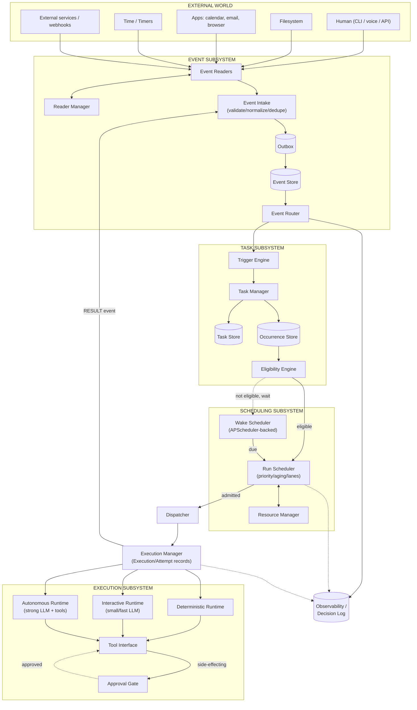
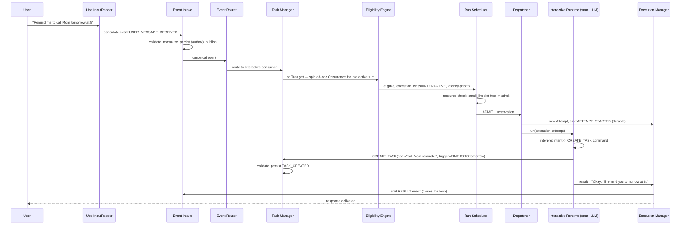
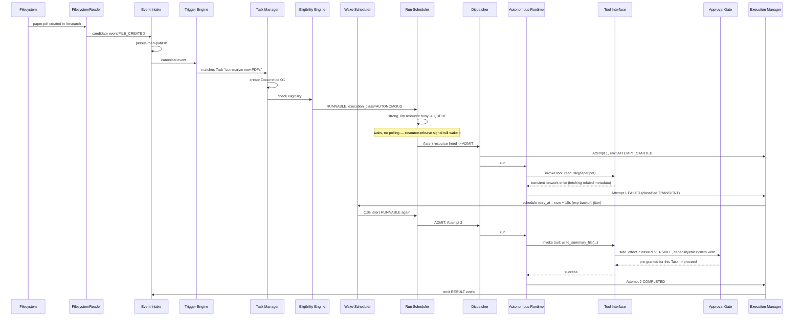
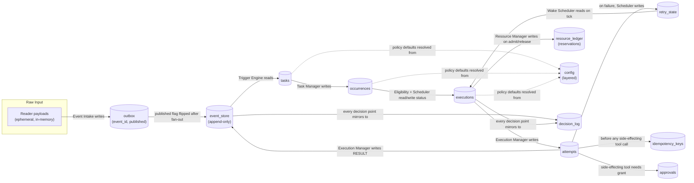

# Pinky — Consolidated Phase 1 Architecture Specification

*Event Subsystem + Task Subsystem + Scheduler Subsystem, consolidated, cross-checked, and closed for implementation.*

---

## 0. Executive Summary

Your three findings documents (`Event_Subsystem.md`, `Task_Subsystem.md`, `Scheduler_Subsystem.md`) are unusually rigorous for a pre-implementation design pass — they already independently arrive at several patterns that production-grade systems converge on (persist-before-publish, event sourcing with replay, admission vs. dispatch separation, non-preemptive scheduling with cooperative cancellation, wake vs. run scheduling). They are consistent with each other and do not contradict one another anywhere I could find. That's the good news.

The bad news: **the documents stop at the boundary of Execution.** They deliberately deferred designing how Deterministic/Interactive/Autonomous work actually *runs*, how tools are called, how results become new Events, and — critically for a system that "operates continuously on a user's machine" — how permissions and safety are enforced. If you start building now, you'll build a beautiful Event → Task → Scheduler pipeline that has nowhere to dispatch to, and you'll be forced to retrofit Execution, security, and the feedback loop later. That retrofit is exactly the "future restructuring" you asked me to avoid.

So this document does four things:

1. **Consolidates** the three documents into one canonical model with no duplicated or conflicting terminology.
2. **Closes the gap** by designing the missing pieces to the same level of rigor: Execution/Attempt, the Dispatcher, the Result→Event feedback loop, a Tool interface, and a permission/approval layer.
3. **Flags over-engineering** — several places where the exploration (rightly, as a thinking exercise) went further than a Phase 1 build needs, and tells you exactly what to defer.
4. **Gives you a concrete, opinionated tech stack and phase plan** so you can start writing code today without re-deciding architecture next month.

Everything below is designed to be **structurally final**: table names, class boundaries, and module boundaries shouldn't need to change shape later, even though behavior inside them will obviously grow.

---

## 1. Analysis of the Existing Findings

### 1.1 What's already solid (keep as-is)

| Concept | Source | Verdict |
|---|---|---|
| Persist-before-publish durability rule | Event Subsystem §9 | Correct, industry-standard (this is the "outbox pattern"). Keep. |
| `Task → Occurrence → Execution → Attempt` hierarchy | Task Subsystem §7, §65 | Correct and important. This is your event-sourcing/audit backbone. Keep exactly as specified. |
| Trigger ≠ Eligibility ≠ Runnable ≠ Queued ≠ Admitted ≠ Dispatched | Task/Scheduler docs | Correct separation of concerns. Keep as **scheduler-internal states**, not persisted Task states (the docs say this explicitly — good instinct, keep it). |
| Wake Scheduler vs. Run Scheduler split, inside one scheduling authority | Scheduler Subsystem §3, §61 | Correct. One authority, two responsibilities. Keep. |
| Non-preemptive execution, cooperative cancellation only | Scheduler Subsystem §33–38 | Correct for a local single-user agent. Keep. |
| Resources as capacity pools (models, GPU, tools, APIs) rather than special-cased scheduler logic | Scheduler Subsystem §29–34 | Correct and elegant — this is the single best idea in the whole set of documents. Keep. |
| Scheduler doesn't understand semantics ("what a PDF is") | Task Subsystem §70 | Correct. Keep as a hard architectural law. |
| Wall clock vs. monotonic clock separation | Scheduler Subsystem §68 | Correct and frequently skipped by hobbyists. Keep. |

### 1.2 Terminology conflicts to resolve now (before writing code)

Small inconsistencies crept in across three separately-written documents. Resolve them like this, once, canonically:

- **"Occurrence" vs. "Execution" ownership of trigger context** — Task Subsystem §65 puts `trigger_context` on Occurrence. Scheduler Subsystem sometimes talks about "Execution requires GPU" as if Execution declares resources. **Resolution:** `Occurrence` carries *why this exists* (causal context). `Execution` carries *what running it needs* (resource requirements) and *what happened* (attempts, status). Never duplicate causal context onto Execution — it should look it up via `occurrence_id → task_id`.
- **"Router" vs. "Trigger Engine" vs. "Eligibility Engine"** — Event Subsystem calls it Router/Consumers; Task Subsystem calls it Trigger Engine + Eligibility Engine. **Resolution:** these are three distinct, ordered components, not synonyms — see §5.2.
- **"Reader Manager" vs. implicit lifecycle ownership** — only named once. **Resolution:** formalize it as a real module (§5.1), because reader crash-isolation is a Phase 1 requirement, not a nice-to-have, for an always-on system.
- **Scheduler-facing states (`WAITING/READY/QUEUED/ADMITTED/DISPATCHED`) vs. Task lifecycle (`DRAFT/ACTIVE/PAUSED/CANCELLED/COMPLETED`)** — the documents warn against conflating these but never nail down where the boundary sits in the schema. **Resolution:** formalized in §7 — these live in *different tables*, full stop.

### 1.3 The actual gap: everything past the Dispatcher

Both Task_Subsystem.md (§72) and Scheduler_Subsystem.md end by explicitly saying "we haven't designed Execution yet" and "that's Execution's job." That's a reasonable place to have paused *exploration*, but it is not a reasonable place to stop *design* before implementation, because:

- The Scheduler's output contract (`ADMIT` with `resource_reservation`) is meaningless unless something on the other end knows how to accept a reservation, run, release it, and report back.
- "Result → New Event" is the closing arrow in your own top-level diagram (Explaination.md) — without designing it concretely, your system is a pipeline with no feedback loop, i.e., not actually the "continuous event-to-action system" you described.
- Nothing in any of the three documents mentions **permissions, sandboxing, or human approval** for actions with real-world side effects (send email, delete file, spend money, message someone). For a system with filesystem/email/browser access running continuously and unattended, this is not a "later" concern — it's a Phase 1 safety requirement. This is the single most important addition in this document.

Section 5.4–5.6 closes this gap.

---

## 2. Comparison to Existing Systems

You're not the first to solve pieces of this. Here's where Pinky's design sits relative to real systems, and what to deliberately borrow vs. deliberately avoid.

| System | What it solves | What Pinky borrows | What Pinky must avoid |
|---|---|---|---|
| **Temporal** (durable workflow orchestration) | Guarantees a workflow resumes exactly where it left off after crashes, via an append-only event history that's replayed on recovery. <cite index="6-1">Temporal executes application logic in a fault-tolerant manner using event sourcing, maintaining an append-only history of events that allows the system to recover from failures and replay execution at any point</cite> | The **event-sourcing recovery model itself**: persistent history is the source of truth, in-memory state is rebuilt from it. This is exactly your Scheduler_Subsystem §58 "persistent vs ephemeral state" idea — Temporal validates it. | Temporal's actual architecture: <cite index="4-1">it requires a separately-run Temporal Server plus Frontend/History/Matching services and a dedicated persistence database</cite>, plus a distinct worker/task-queue polling model. That's a distributed systems solution to a distributed systems problem. Pinky is single-user, single-machine — running a Temporal cluster to schedule "summarize my calendar at 8am" is a cannon for a fly. |
| **Kubernetes scheduler / Slurm** (HPC batch scheduling) | Multi-factor admission (bin-packing resources), fairness, backfill. Your Scheduler_Subsystem already cites Slurm correctly for the aging/multi-factor-priority pattern. | Admission-before-dispatch as one atomic step (your §28); basic backfill idea (§46–48); aging to prevent starvation. | Full backfill planners, reservation calendars, gang scheduling, fair-share accounting across users — all explicitly correctly excluded in your own §98. Confirmed correct; don't second-guess it later. |
| **APScheduler** (Python job scheduler) | Solves exactly the "Wake Scheduler" half of your problem: cron/interval/date triggers, misfire grace windows, persistent job stores that <cite index="9-1">survive scheduler restarts and maintain their state, running jobs that should have run while offline</cite>. | Use it *literally*, not just as inspiration — see §8. It already has correct timezone/DST handling, which your own docs (§67) flag as an easy-to-get-wrong subtlety. Don't reimplement this. | Don't let it own priority, resources, or execution classes — it has no concept of them. It is Wake Scheduler only. |
| **LangGraph / Temporal-for-agents** | Graph-based agent orchestration with per-node checkpointing so a multi-step agent <cite index="20-1">three steps into a ten-step workflow can pick up exactly where it left off when the server restarts, with no lost work</cite>, plus human-in-the-loop interrupts. | Use as the **Autonomous Execution runtime** (§5.6) — its checkpoint model maps directly onto your `Attempt` concept, and its human-in-the-loop interrupt primitive maps directly onto the Approval Gate this document adds in §5.5. | Don't let it become your *whole* architecture. LangGraph orchestrates a single agent's reasoning graph — it has no concept of Events, Occurrences, cross-Task scheduling, or resource fairness across *multiple* Tasks. It plugs in *below* your Dispatcher, not instead of your Scheduler. |
| **Home Assistant automations** | Consumer-grade trigger/condition/action model for a always-on local system. | Validates that Trigger ≠ Condition ≠ Action as three separable pieces (mirrors your Trigger/Eligibility/Execution split) is the right mental model for a home-run agent, not just a datacenter abstraction. | Home Assistant's automations run actions essentially synchronously and have no real scheduler, priority, or resource model — you've already designed something meaningfully more robust; don't regress toward its simplicity out of a desire to "just ship." |
| **Erlang/OTP supervision trees** | Process isolation + automatic restart-with-backoff for crashing workers, without taking down the whole system. | Directly validates your Event Subsystem §6 "Reader failure shouldn't crash Pinky" instinct. Use the supervision-tree *pattern* (isolated unit, restart policy, escalation after N failures) for your Reader Manager and Execution runtimes, even though you won't use Erlang itself. | Don't adopt Erlang/BEAM as your runtime just because the pattern is good — the pattern is implementable in plain Python with `asyncio.Task` + a supervisor loop. |

**Where Pinky is genuinely different, and correctly so:** every comparable system above either (a) treats the LLM/agent-reasoning as mandatory and central (LangGraph, AutoGPT-style agents), or (b) has no concept of "LLM" at all (Temporal, K8s, Slurm, APScheduler). Pinky's actual innovation, per Explaination.md, is treating LLM reasoning as **one optional execution mode among three**, with a real event-driven backbone underneath it that works even when the LLM is down. That's not overengineering — that's the actual thesis of the project, and this consolidated design preserves it end-to-end.

---

## 3. Over-Engineering Audit

Your own documents already self-police reasonably well (Scheduler_Subsystem §98 has an explicit "what I would NOT build" list — keep that list, it's correct). Here's what I'd add or tighten further, because 100+ numbered sections of scheduler theory for a single-user local app has a real risk of gold-plating before a single line of Task code exists.

### 3.1 Cut entirely for Phase 1 (revisit only if real usage demands it)

- **Dependency-aware priority inheritance** (Scheduler_Subsystem §89–91). Correct concept, real academic pedigree (priority inversion / priority inheritance), but it's solving a problem — long dependency chains starving each other — that you will not have with a handful of tasks on one machine. Implement the *dependency* relationship (Task B waits for Task A) in Phase 1; implement priority propagation across it only if you observe actual starvation.
- **Formal backfill algorithm** (§46–52). Your own model — "pick the highest admissible candidate; if blocked, scan for something that doesn't need the blocked resource" — is already a 10-line loop, not a planner. Don't build a reservation calendar or duration-estimation subsystem. A single "skip resource-blocked, try next" pass in the Run Scheduler is sufficient and *is* backfill for a system with single-digit concurrent resources.
- **Weighted queue fairness / minimum service guarantees as a configurable percentage system** (§22–24). Implement item-level aging only (already in your list of what to build). Don't build a queue-level fairness scheduler on day one; three logical lanes with per-lane concurrency caps already prevents the worst starvation case (one lane hogging everything).
- **Generic "policy pipeline" as a pluggable rule engine / DSL.** Several sections describe policy as a pipeline of stages, which is right — but resist the urge to make it a generically pluggable, user-configurable rule engine in Phase 1. Write it as an ordered sequence of plain functions in code. Turn it into configuration only once you have two or three real policies that actually need to vary per-Task.
- **Resource deadlock avoidance machinery** beyond "reserve everything atomically before dispatch" (§51). You already have the correct one-sentence solution. Don't build cycle-detection graphs for a resource set that will have single digits of resource types for a long time.

### 3.2 Genuinely necessary, but simplify the *implementation*, not the *concept*

- **Effective priority formula.** Keep the concept (base + urgency + deadline pressure + bounded aging), but implement it as one small pure function with 4 inputs, not a "scheduling policy" abstraction with pluggable strategies. You can make it pluggable later; you cannot easily add the concept later if you skip it now (see §7 schema — the columns must exist from day one even if the formula is simple).
- **Misfire / catch-up policy** (§64–65). Keep it, but ship with exactly two policies in Phase 1 — `RUN` and `SKIP` — not the full `RUN_MISSED/RUN_LATEST/SKIP_MISSED/LIMITED_CATCHUP` matrix. Add the rest when a real recurring Task needs it.
- **Backpressure policies.** Ship `DROP`, `COALESCE`, and a hard `max_pending` per Task. Skip `REPLACE_OLDEST/REPLACE_NEWEST/BLOCK_SOURCE/PERSIST_OVERFLOW` until a specific Task needs one of them.

### 3.3 Missing and *not* over-engineering — genuinely required (see §5.4–5.6)

- Execution/Attempt/Dispatcher concrete design.
- A permission/approval system for side-effecting tool calls.
- Idempotency keys for anything that causes an external side effect (your own Scheduler_Subsystem §62 explicitly names this as required and then doesn't design it — it's designed in §7 below).

**Net assessment: you are not meaningfully over-engineered on the Event/Task/Scheduler side — you are under-engineered on the Execution/Safety side.** That asymmetry is the main risk to fix before writing code.

---

## 4. Where I Extended the Design, and Why

| Addition | Why it's necessary now, not later |
|---|---|
| **Execution / Attempt runtime contracts** (Deterministic, Interactive, Autonomous as concrete interfaces) | The Dispatcher's entire job is to hand off to *something* — that something needs a defined contract (`run(execution) -> Result`) before you can write the Dispatcher at all. |
| **Result → Event feedback loop, formalized as a component** | Named in your own top-level diagram but never designed. Without it, "Pinky reacts to its own outputs" (e.g., autonomous task's result triggers a follow-up task) isn't actually implementable. |
| **Tool Interface + Capability/Permission model + Approval Gate** | Zero mention across all three documents, but this is a locally-running, continuously-operating agent with filesystem/email/browser access. This is the highest-priority gap. Designed in §5.5. |
| **Idempotency Key table + policy** | Your own Scheduler_Subsystem §62/§76 explicitly *says* this is required ("requires idempotency keys, transactional integrations... where supported") but stops short of a schema. I've closed that loop concretely in §7. |
| **Outbox table, explicit** | Event Subsystem's persist-before-publish rule (§9) is correct but abstract. I've made it a concrete table + delivery-guarantee statement so "at-least-once delivery to consumers" is testable, not just aspirational. |
| **Config layering as a concrete 4-level resolution order** (Global → Execution-class → Task → Occurrence, per your own §87–88) | You proposed the *hierarchy* but not *where it's stored or how it resolves at read time*. Fixed in §7.9. |
| **Single-process, in-process-bus runtime decision** | None of the three documents commit to a process/deployment model. Left undecided, this is the #1 source of "future restructuring" — see §8 for the explicit, final decision and why. |
| **Decision Log as a first-class table, not just a debugging aspiration** | Scheduler_Subsystem §81–82 wants this for debuggability (good instinct) but describes it as something to "eventually" have. I've made it a Phase 0/1 table because retrofitting observability into a running event-sourced system is painful; capturing it from day one is nearly free. |

---

## 5. Final Architecture Overview

### 5.1 Event Subsystem (as designed, formalized)

```
Event Sources → Event Readers → Reader Manager (lifecycle/health/restart)
                                        │
                                        ▼
                                 Event Intake (validate → normalize → dedupe → persist → publish via Outbox)
                                        │
                                        ▼
                                  Event Store (append-only, canonical envelope)
                                        │
                                        ▼
                                  Event Router  ──fan-out──▶  Event Consumers
                                                              (Trigger Engine, State Projectors,
                                                               Wake Matcher, Observability, Notification)
```

Responsibilities are exactly as your Event_Subsystem.md defines them. One clarification made concrete: **Reader → Candidate Event → Intake → Canonical Event**, and Intake is the *only* place allowed to write to the Event Store.

### 5.2 Task Subsystem (as designed, formalized)

```
Trigger fires (TIME | EVENT | CONDITION | DEPENDENCY | MANUAL)
        │
        ▼
Trigger Engine ── matches registered Task triggers ──▶ Occurrence created (via Task Manager)
        │
        ▼
Eligibility Engine (task active? dependencies satisfied? conditions true? not expired? concurrency policy allows it?)
        │
   ┌────┴────┐
   NO         YES
   │           │
 WAITING     RUNNABLE ──▶ enters Scheduler
```

`Task Manager` is the single write-owner of Task state (your §3–4, correctly designed — kept as-is). `Occurrence` is the causal record of one activation (your §7–8, kept as-is).

### 5.3 Scheduler Subsystem (as designed, formalized)

```
RUNNABLE work
     │
     ▼
Hard constraints check  ──impossible──▶ REJECT
     │ admissible
     ▼
Effective priority = f(base_priority, urgency, deadline_pressure, bounded_aging)
     │
     ▼
Logical lane (Deterministic | Interactive | Autonomous) + tie-break (deadline → priority → age → FIFO → stable id)
     │
     ▼
Resource Admission (atomic: check + reserve + admit, single operation)
     │
 ┌───┴───┐
 NO       YES
 │         │
QUEUE   DISPATCH ──▶ Dispatcher
```

Wake Scheduler and Run Scheduler remain one scheduling authority with two responsibilities, exactly as your §61 concludes. Kept as-is.

### 5.4 Dispatcher (new — closes the gap)

The Dispatcher is intentionally thin. Its entire job:

```
Dispatcher.dispatch(admitted_work):
    execution = load_or_create_execution(admitted_work)
    runtime   = runtime_for(execution.execution_class)   # Deterministic | Interactive | Autonomous
    attempt   = execution.new_attempt()
    emit(ATTEMPT_STARTED, attempt.id)                     # durable, BEFORE calling runtime
    runtime.run_async(execution, attempt)                 # fire-and-forget; runtime reports back via events
```

The `emit(ATTEMPT_STARTED)` *before* invoking the runtime is the exact mechanism your Scheduler_Subsystem §60–61 needed and left unresolved ("did E42 actually start?"). After this event is durably recorded, a crash-recovery pass always knows dispatch was attempted, even if it can't know whether the side effect landed — which your own §62 correctly says is an unsolvable general problem, only mitigable via idempotency (§5.5, §7.7).

### 5.5 Execution Subsystem (new — closes the gap)

All three runtimes implement one interface:

```
ExecutionRuntime:
    async def run(execution: Execution, attempt: Attempt) -> None
    async def cancel(execution_id) -> None      # cooperative only, per your non-preemption rule
```

- **Deterministic runtime**: `Event → Rule → Action`. Plain functions. No LLM, no tool-approval overhead (deterministic actions are pre-approved by definition — the Task itself was approved when created).
- **Interactive runtime**: small/fast model, optimized for latency. Produces either a direct response (Result) or a `CREATE_TASK` / `CREATE_OCCURRENCE` command back through the **Task Manager** (never directly).
- **Autonomous runtime**: strong model + tool loop, optimized for throughput, checkpointable (see §8 — this is where LangGraph plugs in directly). Every tool call goes through the **Tool Interface**, not directly to the outside world.

**Tool Interface — the actual gap-closer:**

```
Tool:
    name: str
    side_effect_class: READ_ONLY | REVERSIBLE | IRREVERSIBLE
    required_capability: str          # e.g. "filesystem.write", "email.send"
    idempotent: bool
    async def invoke(args, execution_context) -> ToolResult
```

**Approval Gate (new, and the single most important addition in this document):**

```
before invoking any tool with side_effect_class in {REVERSIBLE, IRREVERSIBLE}:
    if not capability_grant.allows(task.creator, tool.required_capability):
        → HALT execution, emit APPROVAL_REQUIRED, wait for human decision (durable, resumable)
    else:
        → proceed
```

- Capability grants are checked at **Task creation time** (an Interactive-created Task recording "I asked to be allowed to send emails" once) so most executions don't stop and ask every time — but any *irreversible* tool (delete file, send money, message a third party) always requires either a standing grant explicitly scoped to it, or a fresh approval. This mirrors the human-in-the-loop interrupt pattern that production agent frameworks converged on for exactly this reason. <cite index="20-1">Durable execution and human-in-the-loop interrupts are two of the core runtime features that separate production agents from demos</cite>
- This does not block the Scheduler — an execution `WAITING_FOR_APPROVAL` releases its resources exactly like `WAITING_FOR_EVENT` (your own §54 pattern, reused, not reinvented).

### 5.6 Result → Event feedback loop (new — closes the gap)

```
Execution finishes (COMPLETED | FAILED | CANCELLED)
        │
        ▼
Execution Manager records terminal Attempt state (durable)
        │
        ▼
emits RESULT event  ──▶  Event Intake  ──▶  Event Store  ──▶  Event Router
                                                                  │
                                                     ┌────────────┼─────────────┐
                                                     ▼            ▼             ▼
                                              Trigger Engine  Wake Matcher   Observability
                                          (may activate        (may resume     (decision log,
                                           a dependent Task)    a waiting       metrics)
                                                                 Execution)
```

This is the arrow that makes Pinky a *loop*, not a *pipeline* — and it's implemented with the exact same Event Subsystem machinery already designed. No new subsystem was needed, just the explicit wiring, which is why it was easy to miss.

### 5.7 Complete component list (final)

```
1. Event Sources               (external, not Pinky's code)
2. Event Readers                (Push / Listener / Polling / Scheduled / Interactive)
3. Reader Manager                (lifecycle, health, restart+backoff)
4. Event Intake                   (validate, normalize, dedupe, persist, publish via Outbox)
5. Event Store                     (append-only canonical envelope)
6. Event Router                     (fan-out to consumers)
7. Trigger Engine                    (matches Task triggers against events/conditions/time)
8. Eligibility Engine                 (dependencies, conditions, concurrency policy)
9. Task Manager                        (sole write-owner of Task state)
10. Occurrence Store                     (one record per activation)
11. Wake Scheduler                        (future timers: schedules, retries, deadlines — backed by APScheduler)
12. Run Scheduler                          (priority, lanes, fairness/aging, resource admission)
13. Resource Manager                        (capacity pools: CPU/GPU/models/tools/APIs)
14. Dispatcher                                (hands admitted work to a runtime, records ATTEMPT_STARTED)
15. Execution Manager                          (Execution/Attempt lifecycle, retries, cancellation)
16. Deterministic / Interactive / Autonomous     runtimes (implement ExecutionRuntime)
17. Tool Interface + Capability Grants            (what a runtime is allowed to actually do)
18. Approval Gate                                  (human-in-the-loop for side-effecting tools)
19. Observability / Decision Log                    (why did/didn't this run)
20. Config Store                                     (layered: Global → Class → Task → Occurrence)
```

---

## 6. Diagrams

### 6.1 System Architecture



### 6.2 Workflow / Sequence — Interactive request (happy path)



### 6.3 Workflow / Sequence — Event-triggered Autonomous Task with transient failure



### 6.4 Class Diagram

```mermaid
classDiagram
    class EventSource { <<external>> }

    class EventReader {
        <<abstract>>
        +source_id
        +category  %% PUSH|LISTENER|POLLING|SCHEDULED|INTERACTIVE
        +start()
        +stop()
        +health() ReaderHealth
    }
    class FilesystemReader
    class UserInputReader
    class ScheduledReader
    class WebhookReader
    EventReader <|-- FilesystemReader
    EventReader <|-- UserInputReader
    EventReader <|-- ScheduledReader
    EventReader <|-- WebhookReader

    class ReaderManager {
        +readers: List~EventReader~
        +restart_policy
        +on_reader_failed(reader_id)
    }
    ReaderManager "1" o-- "many" EventReader

    class CandidateEvent {
        +source
        +source_event_id
        +raw_payload
        +observed_at
    }

    class EventIntake {
        +validate(candidate) 
        +normalize(candidate)
        +deduplicate(candidate) bool
        +persist(event) 
        +publish(event)
    }

    class Event {
        +id
        +type
        +source
        +occurred_at
        +recorded_at
        +correlation_id
        +causation_id
        +payload
        +metadata
    }
    EventIntake ..> CandidateEvent : consumes
    EventIntake ..> Event : produces

    class OutboxEntry {
        +event_id
        +published: bool
    }
    class EventStore {
        +append(event)
        +read_since(cursor)
    }
    class EventRouter {
        +consumers: List~EventConsumer~
        +route(event)
    }
    class EventConsumer { <<interface>> +on_event(event) }
    EventRouter "1" o-- "many" EventConsumer

    class Trigger {
        +type  %% TIME|EVENT|CONDITION|DEPENDENCY|MANUAL
        +configuration
    }
    class Task {
        +task_id
        +goal
        +creator
        +status  %% DRAFT|ACTIVE|PAUSED|CANCELLED|COMPLETED|EXPIRED
        +trigger: Trigger
        +execution_policy
        +scheduling_policy
        +capability_grants
    }
    class TaskManager {
        +create(spec) Task
        +update(task_id, changes)
        +cancel(task_id)
    }
    TaskManager ..> Task : owns
    Task "1" *-- "1" Trigger

    class Occurrence {
        +occurrence_id
        +task_id
        +trigger_context
        +scheduled_for
        +activated_at
        +status
        +misfire_info
    }
    Task "1" --> "many" Occurrence

    class EligibilityEngine {
        +evaluate(occurrence) bool
    }

    class SchedulingAttributes {
        +base_priority
        +urgency
        +deadline
        +age
        +execution_class
        +resource_cost
        +retry_count
    }
    class Scheduler {
        +wake: WakeScheduler
        +run: RunScheduler
    }
    class WakeScheduler {
        +schedule(work_id, at)
        +on_due(work_id)
    }
    class RunScheduler {
        +effective_priority(attrs) float
        +select_candidate(queue) WorkItem
        +admit(candidate) Reservation
    }
    Scheduler "1" *-- "1" WakeScheduler
    Scheduler "1" *-- "1" RunScheduler

    class Resource {
        +name
        +capacity
        +available
    }
    class ResourceManager {
        +reserve(resource_name, amount) Reservation
        +release(reservation)
    }
    ResourceManager "1" o-- "many" Resource

    class Dispatcher {
        +dispatch(reservation, occurrence)
    }

    class Execution {
        +execution_id
        +occurrence_id
        +execution_class
        +status  %% EXECUTING|WAITING|COMPLETED|FAILED|CANCELLED
        +resource_requirements
    }
    class Attempt {
        +attempt_id
        +execution_id
        +started_at
        +ended_at
        +result
        +failure_class
    }
    Occurrence "1" --> "0..1" Execution
    Execution "1" *-- "many" Attempt

    class ExecutionManager {
        +new_attempt(execution) Attempt
        +record_result(attempt, result)
        +cancel(execution_id)
    }
    ExecutionManager ..> Execution : owns

    class ExecutionRuntime {
        <<interface>>
        +run(execution, attempt)
        +cancel(execution_id)
    }
    class DeterministicRuntime
    class InteractiveRuntime
    class AutonomousRuntime
    ExecutionRuntime <|-- DeterministicRuntime
    ExecutionRuntime <|-- InteractiveRuntime
    ExecutionRuntime <|-- AutonomousRuntime

    class Tool {
        <<interface>>
        +name
        +side_effect_class  %% READ_ONLY|REVERSIBLE|IRREVERSIBLE
        +required_capability
        +idempotent
        +invoke(args, context) ToolResult
    }
    class ApprovalGate {
        +check(task, tool) Decision
        +request_approval(execution_id, tool)
    }
    AutonomousRuntime ..> Tool : invokes
    Tool ..> ApprovalGate : checked by

    class DecisionLog {
        +record(work_id, decision, reason)
    }
```



### 6.5 Data Flow Diagram

*(data at rest and how it moves between stores — not control flow)*



---

## 7. Data Model (concrete SQLite schema draft)

This is deliberately concrete — "no future restructuring" means the table shapes below shouldn't need column-type surgery later, even as behavior grows.

```sql
-- 7.1 Events (append-only, canonical envelope)
CREATE TABLE events (
    id              TEXT PRIMARY KEY,      -- ULID, sortable
    type            TEXT NOT NULL,
    source          TEXT NOT NULL,
    source_event_id TEXT,                  -- for dedup with unstable sources
    occurred_at     TEXT NOT NULL,         -- wall-clock ISO8601, source's claim
    recorded_at     TEXT NOT NULL,         -- wall-clock ISO8601, Pinky's clock
    correlation_id  TEXT,
    causation_id    TEXT,                  -- points at the event/attempt that caused this one
    payload         TEXT NOT NULL,         -- JSON
    metadata        TEXT,                  -- JSON
    UNIQUE(source, source_event_id)
);

-- 7.2 Outbox (persist-before-publish guarantee)
CREATE TABLE outbox (
    event_id    TEXT PRIMARY KEY REFERENCES events(id),
    published   INTEGER NOT NULL DEFAULT 0,
    attempts    INTEGER NOT NULL DEFAULT 0,
    last_error  TEXT
);

-- 7.3 Tasks (Task Manager is sole writer)
CREATE TABLE tasks (
    id                  TEXT PRIMARY KEY,
    goal                TEXT NOT NULL,
    creator             TEXT NOT NULL,      -- 'user' | 'system' | execution_id of creating agent
    status              TEXT NOT NULL,      -- DRAFT|ACTIVE|PAUSED|CANCELLED|COMPLETED|EXPIRED
    trigger_type        TEXT NOT NULL,      -- TIME|EVENT|CONDITION|DEPENDENCY|MANUAL
    trigger_config      TEXT NOT NULL,      -- JSON
    execution_class     TEXT NOT NULL,      -- DETERMINISTIC|INTERACTIVE|AUTONOMOUS
    concurrency_policy  TEXT NOT NULL DEFAULT 'QUEUE',   -- ALLOW_PARALLEL|QUEUE|SKIP|COALESCE|REPLACE
    retry_policy        TEXT NOT NULL,      -- JSON: {max_attempts, base_backoff_s, max_backoff_s, jitter}
    misfire_policy      TEXT NOT NULL DEFAULT 'RUN',     -- RUN|SKIP (Phase 1 only two values, see §3.2)
    base_priority        INTEGER NOT NULL DEFAULT 50,
    deadline_policy       TEXT,             -- JSON, optional
    capability_grants     TEXT,             -- JSON list of pre-approved tool capabilities
    max_pending            INTEGER NOT NULL DEFAULT 100,
    backpressure_policy     TEXT NOT NULL DEFAULT 'COALESCE', -- DROP|COALESCE (see §3.2)
    created_at TEXT NOT NULL,
    updated_at TEXT NOT NULL
);

-- 7.4 Occurrences (causal record of one activation)
CREATE TABLE occurrences (
    id               TEXT PRIMARY KEY,
    task_id          TEXT NOT NULL REFERENCES tasks(id),
    trigger_context  TEXT NOT NULL,   -- JSON: {source_event_id} or {scheduled_for}
    scheduled_for    TEXT,            -- wall-clock, if time-based
    activated_at     TEXT,
    status           TEXT NOT NULL,   -- PENDING|ELIGIBLE|WAITING|RUNNABLE|COMPLETE|SKIPPED
    misfire_applied  TEXT
);

-- 7.5 Executions (one attempt-series per occurrence, usually 0 or 1)
CREATE TABLE executions (
    id                    TEXT PRIMARY KEY,
    occurrence_id         TEXT NOT NULL REFERENCES occurrences(id),
    execution_class       TEXT NOT NULL,
    status                TEXT NOT NULL,  -- EXECUTING|WAITING|COMPLETED|FAILED|CANCELLED
    resource_requirements TEXT NOT NULL,  -- JSON list of {resource_name, amount}
    wait_reason           TEXT,           -- e.g. WAITING_FOR_EVENT, WAITING_FOR_APPROVAL
    wake_condition        TEXT,           -- JSON, what un-waits this execution
    created_at            TEXT NOT NULL,
    updated_at            TEXT NOT NULL
);

-- 7.6 Attempts (one per try; Attempt IDs solve the "did it start" ambiguity, §5.4)
CREATE TABLE attempts (
    id             TEXT PRIMARY KEY,
    execution_id   TEXT NOT NULL REFERENCES executions(id),
    attempt_number INTEGER NOT NULL,
    started_at     TEXT,             -- set on ATTEMPT_STARTED event, durably, before runtime invoked
    ended_at       TEXT,
    result         TEXT,             -- JSON
    failure_class  TEXT,             -- TRANSIENT|PERMANENT|POLICY|RESOURCE|TIMEOUT|CANCELLED|UNKNOWN
    UNIQUE(execution_id, attempt_number)
);

-- 7.7 Idempotency keys (closes the "exactly-once side effects" gap from Scheduler_Subsystem §62)
CREATE TABLE idempotency_keys (
    key            TEXT PRIMARY KEY,      -- deterministic hash of (tool_name, attempt_id, args)
    tool_name      TEXT NOT NULL,
    attempt_id     TEXT NOT NULL REFERENCES attempts(id),
    external_ref   TEXT,                  -- e.g. provider's message-id, if returned
    status         TEXT NOT NULL,         -- PENDING|CONFIRMED|UNKNOWN
    created_at     TEXT NOT NULL
);

-- 7.8 Retry / wake schedule (backing store for Wake Scheduler)
CREATE TABLE wake_schedule (
    id           TEXT PRIMARY KEY,
    work_type    TEXT NOT NULL,   -- OCCURRENCE_DUE|RETRY|DEADLINE_CHECK|TASK_RECURRENCE
    work_ref_id  TEXT NOT NULL,
    due_at       TEXT NOT NULL,   -- wall-clock
    payload      TEXT
);
CREATE INDEX idx_wake_due ON wake_schedule(due_at);

-- 7.9 Resources + reservations (Resource Manager)
CREATE TABLE resources (
    name      TEXT PRIMARY KEY,   -- e.g. 'strong_llm', 'small_llm', 'gpu', 'browser'
    capacity  INTEGER NOT NULL
);
CREATE TABLE resource_reservations (
    id            TEXT PRIMARY KEY,
    resource_name TEXT NOT NULL REFERENCES resources(name),
    execution_id  TEXT NOT NULL REFERENCES executions(id),
    amount        INTEGER NOT NULL,
    reserved_at   TEXT NOT NULL,
    released_at   TEXT
);

-- 7.10 Approvals (Approval Gate, human-in-the-loop)
CREATE TABLE approvals (
    id            TEXT PRIMARY KEY,
    execution_id  TEXT NOT NULL REFERENCES executions(id),
    tool_name     TEXT NOT NULL,
    requested_at  TEXT NOT NULL,
    decided_at    TEXT,
    decision      TEXT   -- APPROVED|DENIED
);

-- 7.11 Config (layered resolution: Global -> Class -> Task -> Occurrence)
CREATE TABLE config (
    scope      TEXT NOT NULL,   -- GLOBAL|CLASS|TASK|OCCURRENCE
    scope_ref  TEXT,            -- NULL for GLOBAL, execution_class for CLASS, task_id/occurrence_id otherwise
    key        TEXT NOT NULL,
    value      TEXT NOT NULL,   -- JSON
    PRIMARY KEY (scope, scope_ref, key)
);
-- resolution order at read time: OCCURRENCE > TASK > CLASS > GLOBAL, first match wins

-- 7.12 Decision log (debuggability, cheap to write from day one)
CREATE TABLE decision_log (
    id          TEXT PRIMARY KEY,
    work_id     TEXT NOT NULL,      -- occurrence_id or execution_id
    at          TEXT NOT NULL,
    decision    TEXT NOT NULL,      -- ADMIT|WAIT|REJECT|SELECT|SKIP
    reason      TEXT NOT NULL,
    attributes  TEXT                -- JSON snapshot: effective_priority, resource state, etc.
);
```

Note what's deliberately **not** in this schema: no `priority` column that gets mutated over time (per your own §13/§25 insight — `base_priority` is stored, `effective_priority` is always computed at read time from `base_priority + created_at + deadline_policy`, never persisted).

---

## 8. Tech Stack Recommendation

Design principle for all choices below: **Pinky is a single-user, single-machine, always-on process.** Every recommendation optimizes for "zero ops, one process, one database" and explicitly avoids distributed-systems tooling that would only pay for itself at multi-user or multi-machine scale.

| Layer | Recommendation | Why |
|---|---|---|
| **Runtime / language** | Python 3.12+, single process, `asyncio` | I/O-bound workload (waiting on LLMs, filesystem, network) is exactly what asyncio is for; Python has the best LLM/tool ecosystem for the Autonomous runtime; a single process avoids inter-process serialization overhead for what is fundamentally one control loop. Revisit only if a specific hot path (e.g. embedding computation) genuinely needs native speed — solve that with a narrow extension, not a language rewrite. |
| **Source of truth / persistence** | SQLite, WAL mode, single writer task | Zero ops, ACID, durable, and — critically — this *is* the event-sourcing store your own docs already assume exists. A single dedicated "writer" asyncio task serializes all writes to avoid SQLite write contention (the standard local-first pattern); readers use WAL concurrent reads freely. Do **not** reach for Postgres/MySQL for a single-user local agent — that's solving a multi-writer problem you don't have. |
| **Outbox pattern implementation** | Hand-rolled table (§7.2) + a background drain task | This is a ~40-line loop (`SELECT unpublished ORDER BY id; fan out; mark published`), not a library problem. (Confirmed by prior art: minimal outbox implementations for local SQLite apps are intentionally this simple — <cite index="23-1">a durable, config-driven SQLite transactional outbox designed for single-process deployments with asyncio</cite> is the same shape, zero external dependencies.) |
| **Wake Scheduler (cron/interval/date + misfire grace + timezone/DST)** | **APScheduler** (`AsyncIOScheduler`, SQLAlchemy job store on the same SQLite file) | This is a solved problem — don't reimplement cron parsing, DST handling, or misfire-grace windows. <cite index="9-1">If jobs are stored in a database they survive scheduler restarts and maintain their state, and when the scheduler restarts it runs all jobs it should have run while offline</cite> — exactly your §64 requirement, for free. **Scope it strictly**: APScheduler only ever calls one function — `on_wake_due(work_ref_id)` — which hands off into your own Run Scheduler. It must never touch priority, resources, or execution classes; those stay custom, per §5.3. |
| **Run Scheduler / priority / resource admission** | Hand-written, in-process | Nothing off-the-shelf models your Task→Occurrence→Execution hierarchy or your resource-capacity-pool model — this is genuinely bespoke and should be, per your own correct instinct (§2 comparison table: Temporal/K8s/Slurm all solve adjacent-but-different problems at the wrong scale). |
| **In-process event bus** | Plain `asyncio.Queue` fan-out (Router = list of subscriber queues) | Single process, single machine — a message broker (Kafka/NATS/Redis Streams) adds an entire second piece of infrastructure to operate for a problem that a list of queues solves in-process for free. Add a real broker only if/when Pinky becomes multi-process or multi-machine, which is explicitly out of scope for Phase 1. |
| **Filesystem reader** | `watchdog` | Cross-platform native APIs — <cite index="31-1">it provides a cross-platform API to observe file creations, modifications, and deletions using native APIs (inotify, FSEvents, kqueue, ReadDirectoryChangesW) or a polling fallback</cite> — exactly the Push/Listener reader category your Event Subsystem defines, already handling the OS-specific mess for you. |
| **Autonomous runtime (strong LLM + tool loop)** | **LangGraph** | It gives you, out of the box, the two hardest parts of the Autonomous runtime you haven't designed yet: durable per-step checkpointing (maps directly onto your `Attempt` records) and human-in-the-loop interrupts (maps directly onto the Approval Gate in §5.5). <cite index="22-1">LangGraph is a low-level orchestration framework that does not abstract prompts or architecture — you define nodes, edges, and typed state, and the runtime executes the graph with checkpointing at every super-step</cite>. It plugs in *underneath* your Dispatcher as one implementation of `ExecutionRuntime`, not as a replacement for anything above it. |
| **Interactive runtime (small/fast LLM)** | Any small local model behind a thin abstraction (Ollama/llama.cpp locally, or a hosted small-model API) — modeled purely as a `Resource` with `capacity=N` | Per your own §33 insight, the scheduler shouldn't know it's "small" vs "strong" — just a named resource with a capacity. Keep the actual model swappable behind that interface from day one. |
| **Config** | TOML files for Global/Class defaults, `config` table (§7.11) for Task/Occurrence overrides | Human-editable defaults, database-backed overrides that need to change at runtime (e.g. a Task's own priority) — matches your own layered-policy design (§87–88) exactly. |
| **Observability** | Structured logging (`structlog`) + the `decision_log` table (§7.12) from day one; OpenTelemetry only if/when you need cross-process tracing later | The decision log is the actual debugging tool your own §81–82 asks for; a generic tracing stack is overkill for one process. |
| **Interactive front-end (Phase 1)** | CLI / stdin reader first; a local FastAPI + WebSocket surface only once CLI is solid | Don't build a GUI before the event loop underneath it works — the Interactive Reader category in your own design is front-end agnostic by construction, so this is a true "add later without restructuring" case. |

---

## 9. Phase Plan and Procedural Checkpoints

Each phase has a **hard exit checkpoint** — a concrete, testable condition you should not move past until it's true. This is what prevents "future restructuring": every phase's checkpoint specifically tests the seam that the next phase will build on top of.

### Phase 0 — Foundations
**Build:** repo scaffold; SQLite schema + migration tool applying §7 as-is; config loader with the 4-level resolution order; structured logging; `decision_log` write path wired in (even if nothing writes to it yet); process entrypoint that starts/stops cleanly.
**Checkpoint:** cold-start on an empty DB creates all tables; process starts, logs a heartbeat, and shuts down cleanly on SIGTERM; a health-check command reports "no readers running yet" honestly (not silently green).

### Phase 1 — Event Subsystem
**Build:** `ReaderManager` with restart+backoff; `UserInputReader` (stdin/CLI), `ScheduledReader` (heartbeat timer), `FilesystemReader` (watchdog-backed); `EventIntake` with the outbox; `EventStore`; `EventRouter` with at least one real consumer (Observability) and one stub consumer.
**Checkpoint:**
- Inject a synthetic filesystem event → verify it is durably persisted **before** any consumer sees it (kill the process between persist and publish in a test harness; on restart, the outbox drain redelivers it).
- Send the same `source_event_id` twice → verify dedup rejects the second.
- Force a reader to raise an exception → verify the process does not crash and the reader auto-restarts with backoff, capped after N failures with a `READER_FAILED` state visible in health-check.

### Phase 2 — Task Subsystem
**Build:** `TaskManager` (create/update/cancel, full lifecycle from §5.2); `Trigger Engine` for `TIME`, `EVENT`, and `MANUAL` (defer `CONDITION`/`DEPENDENCY` to Phase 5 per §3.1); `Occurrence` creation; minimal `Eligibility Engine` (task active + not expired only — defer condition/dependency checks).
**Checkpoint:**
- Create a Task via CLI with a `TIME` trigger for 60 seconds from now → an Occurrence is created automatically at the right wall-clock second.
- Create a Task with an `EVENT` trigger matching `FILE_CREATED` → dropping a file into a watched folder produces exactly one Occurrence.
- Cancel a Task with a pending Occurrence → the Occurrence is marked `SKIPPED`, not silently orphaned.

### Phase 3 — Scheduling Subsystem
**Build:** Wake Scheduler wired to APScheduler (persistent job store on the same SQLite file); Run Scheduler with effective-priority function, three logical lanes, bounded aging, resource admission as one atomic operation, `max_pending`/`COALESCE`/`DROP` backpressure, non-preemptive dispatch, `decision_log` writes on every admit/wait/reject.
**Checkpoint:**
- Two Occurrences competing for a `capacity=1` resource resolve deterministically (same inputs → same winner every run), and `decision_log` shows a human-readable reason for both the winner and the loser.
- Simulate a burst of 1,000 events mapped to one Task with `max_pending=100, backpressure_policy=COALESCE` → confirm only ≤100 Occurrences ever exist for that Task at once and no unbounded memory/DB growth.
- Kill the process mid-dispatch (after `ADMIT`, before `ATTEMPT_STARTED` is durably recorded) → on restart, recovery does not double-grant the reserved resource, and the ambiguous execution is flagged, not silently retried twice.

### Phase 4 — Execution, Dispatcher, and Feedback Loop
**Build:** `Dispatcher`; `ExecutionManager`; `DeterministicRuntime` (plain rule/action, no LLM); `InteractiveRuntime` (small model, CLI round-trip); `AutonomousRuntime` (LangGraph-based, at least one real tool); `Tool Interface`; `Approval Gate`; the Result→Event wiring closing the loop from §5.6.
**Checkpoint:**
- A purely Deterministic Task (e.g. "notify me when disk space < 10%") runs correctly with **zero** LLM calls in its path — verify by asserting no model resource was reserved.
- With an Autonomous task occupying the strong-model resource, an Interactive question gets a response without waiting behind it (measure p95 latency under load).
- An Autonomous task calls a tool marked `IRREVERSIBLE` with no standing capability grant → execution durably enters `WAITING_FOR_APPROVAL`, releases its resource reservation, and resumes correctly after a human approves it via CLI — even across a process restart in between.
- A completed Execution's `RESULT` event visibly triggers a second, dependent Task (proving the loop actually closes, not just that Results get logged).

### Phase 5 — Hardening
**Build:** exponential backoff + jitter for retries (already scheduled, now actually tested under failure injection); `idempotency_keys` enforced on at least one real side-effecting tool (e.g. "send notification"); `CONDITION` and `DEPENDENCY` trigger types added to the Trigger Engine deferred from Phase 2; recurring-Task overlap policy (`QUEUE`/`SKIP`/`COALESCE`) actually enforced; a `pinky why <id>` CLI command that reconstructs the full causal chain from `decision_log` + `events` + `attempts`.
**Checkpoint:**
- Kill the process (`kill -9`) mid-tool-call on a side-effecting tool with an idempotency key already written as `PENDING` → on retry, confirm the tool is not invoked twice with real-world effect (verify via the tool's own dedup, e.g. mocked "email provider" logging one send, not two).
- Artificially slow a recurring Task's execution past its own interval → verify the configured overlap policy behaves exactly as specified (e.g. `SKIP` genuinely skips the overlapping occurrence rather than queuing it).
- `pinky why <attempt_id>` on any completed Attempt reproduces, in order: originating Event → matched Trigger → Task → Occurrence → scheduling decision with reason → Attempt(s) → Result. If any link in that chain is unreconstructable, that's a bug to fix before Phase 6, not a documentation gap.

### Phase 6 — Explicitly deferred (do not start until Phase 5 checkpoints all pass)
Multi-model routing / true two-LLM setup; richer Condition Engine (continuous state conditions, not just event-triggered checks); plugin marketplace for third-party Readers/Tools; GUI beyond CLI; queue-level (not just item-level) fairness; formal backfill/duration-estimation; cross-device sync. None of these require restructuring anything built in Phases 0–5 — that's the point of doing the audit in §3 now.

---

## 10. Glossary (canonical terms — use these exact words in code and docs)

| Term | Definition |
|---|---|
| **Event** | Something that happened, recorded once, immutably, in the Event Store. |
| **Task** | A persistent responsibility ("what should happen"), owned exclusively by the Task Manager. |
| **Occurrence** | One causal activation of a Task (e.g. "the Sept 15 instance"). |
| **Execution** | The record of actually attempting an Occurrence's work; 0 or 1 per Occurrence, but may span multiple Attempts. |
| **Attempt** | One try at an Execution; carries `started_at`/`ended_at`/`result`/`failure_class`. |
| **Eligible** | Trigger has fired and Task-level preconditions (active, dependencies, conditions) are satisfied. Not yet a scheduling concept. |
| **Runnable / Queued / Admitted / Dispatched** | Scheduler-internal states only — never persisted as Task or Occurrence status. |
| **Resource** | Any capacity-limited thing an Execution needs (model, GPU, tool, API) — modeled uniformly regardless of what it physically is. |
| **Effective priority** | Always computed at read time from `base_priority + urgency + deadline_pressure + bounded_aging` — never stored as a mutated column. |
| **Capability grant** | A standing permission on a Task allowing a specific tool/side-effect without a fresh approval each time. |
| **Idempotency key** | A deterministic key preventing a retried side-effecting tool call from producing the effect twice. |
